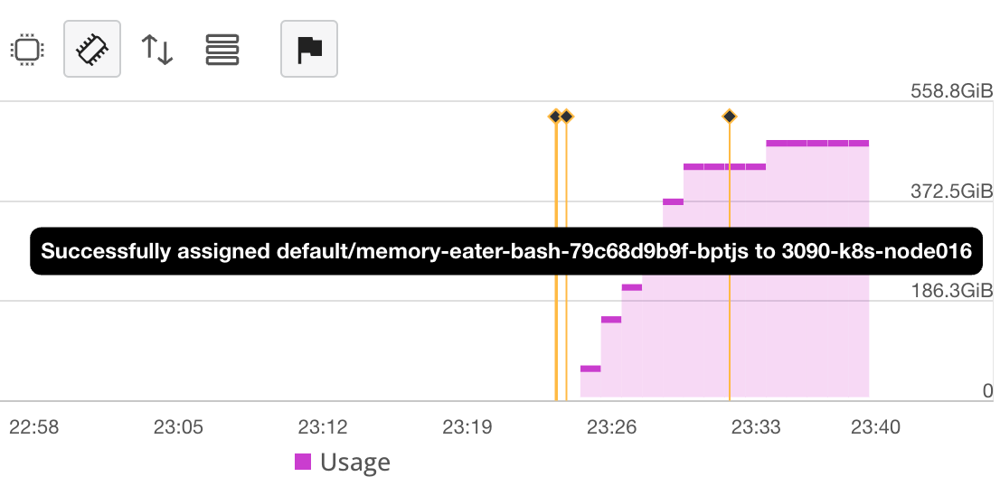

## The Problem

Recently we found some of our Kubernetes nodes were constant going down, completely dead, with no luck connecting to it. Taints like `node.kubernetes.io/unreachable:NoSchedule` and `node.kubernetes.io/unreachable:NoExecute` were automatically added to the nodes because the `kubelet` was not able to communicate with the API server. The only way to bring the node back was to restart it. After some debugging, we found out that some bad gVisor-created (`runsc` runtime) Pods was eating all the memory of the node and killing it. Traditional Pods with `runc` runtime were running fine.

You may say, "But there are memory limit on a Pod. If it uses more than the limit it should be killed by the OOM killer, right"？ That's what I thought too, so I applied the following Deployment to intentionally consume some memory and see if it will be killed.

<details>
<summary>Click to see full yaml</summary>

```yaml
apiVersion: apps/v1
kind: Deployment
metadata:
  labels:
    app: memory-eater-bash
  name: memory-eater-bash
  namespace: default
spec:
  replicas: 1
  selector:
    matchLabels:
      app: memory-eater-bash
  template:
    metadata:
      labels:
        app: memory-eater-bash
    spec:
      containers:
      - command:
        - bash
        args:
        - -c
        - big_var=data; while true; do big_var="$big_var$big_var"; done; sleep 2d
        image: python:3.12-bookworm
        name: ubuntu
        securityContext:
          readOnlyRootFilesystem: true
          runAsNonRoot: true
          runAsUser: 999
        resources:
          limits:
            cpu: 100m
            memory: 256Mi
          requests:
            cpu: 100m
            memory: 200Mi
      dnsPolicy: Default
      hostNetwork: true
      restartPolicy: Always
      runtimeClassName: gvisor
```
</details>

I applied 256MiB memory limit on it, hoping it will be kill after it uses more than 256MiB memory. But it didn't. *It kept eating all the memory until the node was dead*, bypass OOM protection provided by Kubernetes. It ate over 500GiB of memory, which is the total memory of the node, and we were no longer able to connect to the node. Luckily, we eviction process kicked in and existing Pods on the node are moved to other nodes, so the service was not affected by much.



## The Debug Process

Of course, we need to apply the above memory-eater Deployment to reproduce the issue. But killing a node every time is not a good idea 😂 , especially when we need to manually restart it. So I used another Deployment to consume *some* (1GiB) memory, but not all of it.

<details>
<summary>Click to see full yaml</summary>

```yaml
apiVersion: apps/v1
kind: Deployment
metadata:
  labels:
    app: memory-eater-python
  name: memory-eater-python
  namespace: default
spec:
  replicas: 1
  selector:
    matchLabels:
      app: memory-eater-python
  template:
    metadata:
      labels:
        app: memory-eater-python
    spec:
      containers:
      - command:
        - python
        args:
        - -c
        - big_list = []; print('Allocating 1GB of memory...'); [big_list.append(' ' * 10**6) for _ in range(1000)]; import time; time.sleep(100000)
        image: python:3.12-bookworm
        name: ubuntu
        securityContext:
          readOnlyRootFilesystem: true
          runAsNonRoot: true
          runAsUser: 999
        resources:
          limits:
            cpu: 100m
            memory: 256Mi
          requests:
            cpu: 100m
            memory: 200Mi
      dnsPolicy: Default
      hostNetwork: true
      restartPolicy: Always
      runtimeClassName: gvisor
```
</details>

Just as I expected, the memory limit did not work. Time to debug.

### Trying to reproduce

Before I trying to do anything on the production cluster, I tried to reproduce the issue on my local machine. Just to be safe not to kill the production cluster and get fired :P (just kidding. It's because debugging is a lot easier on my local machine). 

I used Docker with gVisor as per the [official documentation](https://gvisor.dev/docs/user_guide/quick_start/docker/). It was working fine. Our production cluster is using `containerd`, so was it a `containerd` issue? I was in a hurry so I used `minikube` with `gVisor` addon enabled, which should provide a Kubernetes cluster with `containerd` and gVisor (and a `containerd` shim for `runsc`). At the time of writing, it was Kubernetes `v1.28.3`, containerd `v1.6.24`, and gVisor `release-20240401.0`.

> I know, I know. We should keep versions of the software same as the production cluster. But I was in a hurry and I was not sure if the issue was with `containerd` or `gVisor`. So I just went with it. Spoiler: yes, it has something to do with versions. If I were to do it again, I would use the same versions as the production cluster.

```bash
minikube start --addons="gvisor" --container-runtime=containerd  --driver=docker --cpus=6
```

I applied the memory-eater Deployment and waited some surprising results. But the 256MiB memory limit was working as expected. The Pod was killed after it used more than 256MiB memory. I smelled some fishy things going on in the production cluster.

### Debugging on the production cluster

Again, I applied the memory-eater Deployment, but on the production cluster this time. Hoping it will not kill the node. To my relief, it did not kill the node. But it did not kill the Pod with its memory (969MiB) above limits (256MiB) either (which is expected).

```console
$ kubectl top pod memory-eater-python-67cc4dd4f7-sp2r6
NAME                                   CPU(cores)   MEMORY(bytes)
memory-eater-python-67cc4dd4f7-sp2r6   0m           969Mi
```

Before I dig anything deeper (like with some gVisor debugging tools), I checked the sandbox created by `runsc` (gVisor) to see if there is anything suspicious.

```console
# On production node
$ PID=$(ps aux | grep memory-eater-python | grep runsc-sandbox | awk '{print $2}')
$ cat /proc/$PID/cmdline | tr '\0' '\n'
runsc-sandbox
--log-format=json
--panic-log=/var/log/pods/default_memory-eater-python-74975bf59f-7fflh_1cf55082-d769-4a51-a424-2312c23eae82/gvisor_panic.log
--root=/run/containerd/runsc/k8s.io
--log=/run/containerd/io.containerd.runtime.v2.task/k8s.io/6a541285fa39d743dc20bd8b3169c4a8f5cd4d77542144fe82d3f6f7af469c2c/log.json
--log-fd=3
--panic-log-fd=4
boot
--apply-caps=false
--bundle=/run/containerd/io.containerd.runtime.v2.task/k8s.io/6a541285fa39d743dc20bd8b3169c4a8f5cd4d77542144fe82d3f6f7af469c2c
--controller-fd=10
--cpu-num=96
--io-fds=5,6
--mounts-fd=7
--overlay-mediums=0,0
--setup-root=false
--spec-fd=11
--start-sync-fd=8
--stdio-fds=12,13,14
--total-host-memory=540886331392
--total-memory=540886331392 # 503GiB
--user-log-fd=9
--product-name=AS
-4124GS-TNR
--proc-mount-sync-fd=22
6a541285fa39d743dc20bd8b3169c4a8f5cd4d77542144fe82d3f6f7af469c2c
```

Hmm, something caught my eye.

```
--total-host-memory=540886331392
--total-memory=540886331392 # 503GiB
```

Why is the `total-memory` and `total-host-memory` set to 503GiB? That's the total memory of the node. I assume it should be set to the memory limit of the Pod, which is 256MiB. To verify my assumption, I checked the sandbox created by `runsc` on my local machine and it indeed was set to 256MiB.

```console
# On my local machine
$ PID=$(ps aux | grep memory-eater-python | grep runsc-sandbox | awk '{print $2}')
$ cat /proc/$PID/cmdline | tr '\0' '\n'
runsc-sandbox
--root=/run/containerd/runsc/k8s.io
--log=/run/containerd/io.containerd.runtime.v2.task/k8s.io/f11a26742777348875e6c7f182d9f8cc5c4a1c3a7f726ad5e8cb956b0c2dea96/log.json
--log-format=json
--panic-log=/var/log/pods/default_memory-eater-python-fc75975c8-vncwz_480a4dd9-22ad-4e43-9ecb-b797735e990a/gvisor_panic.log
--log-fd=3
--panic-log-fd=4
boot
--apply-caps=false
--bundle=/run/containerd/io.containerd.runtime.v2.task/k8s.io/f11a26742777348875e6c7f182d9f8cc5c4a1c3a7f726ad5e8cb956b0c2dea96
--controller-fd=10
--cpu-num=6
--dev-io-fd=-1
--gofer-mount-confs=lisafs:none,lisafs:none
--io-fds=5,6
--mounts-fd=7
--setup-root=false
--spec-fd=11
--start-sync-fd=8
--stdio-fds=12,13,14
--total-host-memory=2061119488
--total-memory=268435456 # 256MiB
--user-log-fd=9
--proc-mount-sync-fd=22
f11a26742777348875e6c7f182d9f8cc5c4a1c3a7f726ad5e8cb956b0c2dea96
```

It has the correct limits on my local machine.

```
--total-host-memory=2061119488
--total-memory=268435456 # 256MiB
```

So the issue was with this `--total-memory` argument. But why is it incorrect on the production cluster?

### Checking the versions

Seeing the difference, I checked the versions on my local cluster and the production cluster.

| Tool       | Local      | Production  |
| ---------- | ---------- | ----------- |
| Kubernetes | 1.28.3     | 1.26.2      |
| containerd | v1.6.24    | v1.7.0-rc.1 |
| runsc      | 20240401.0 | 20231009.0  |

Both are running Ubuntu Server 22.04 LTS, using systemd+cgroupsv2.

I assume the problem was with runsc (gVisor).

## What's wrong with gVisor?

### Cgroups v2 support

After I know the issue is with the `--total-memory` flag. I found there is a similar issue reported [google/gvisor #9580](https://github.com/google/gvisor/issues/9580). The author had great explanation of the issue:

> Under Kubernetes + cgroups v2 + systemd, gVisor launches all processes into the container subgroup associated with the pause container. This makes some sense given that cgroups v2 specifies that processes can only exist at leaf nodes, and the pod's cgroup is registered as a slice (an intermediate unit which cannot have its own processes) with systemd. When the sandbox is launched gVisor needs a container subgroup and the pause container is the first to be launched. The pause container is a child of the pod cgroup and therefore inherits the limits of the parent pod cgroup, BUT the child's controllers reflect the default max value. This in turn means that this code which reads the memory limit and cpu quota reads these as unlimited.

Let me explain a bit more. So a normal cgroup v2 hierarchy for a Pod looks like this:

```
/sys/fs/cgroup/kubepods.slice/
├── kubepods-burstable.slice
│   └── kubepods-burstable-pod<pod_id>.slice # has memory limit
│       └── cri-containerd-<container_id>.scope # no memory limit
```

The pod slice has a memory limit (cat `memory.max` gives `xxx`), but the container scope does not (cat `memory.max` gives `max`). The container scope is where the container is running. The container scope is a child of the pod slice. So the container should inherit the memory limit of the pod slice. This is how cgroups works.

But gVisor only checks the container scope and says "oh, it has no memory limit. Let's set the total memory to max (the total memory of the node)". And that's why the `--total-memory` is set to 503GiB on the production cluster.

This issue was fixed in [google/gvisor #9631](https://github.com/google/gvisor/pull/9631). The code below is from the PR which fixed the issue (after the comments). So it checks the Pos slice (parent) if the memory limit is not set in the container slice (leaf node).

```go
// File: runsc/cgroup/cgroup_v2.go
// Link: https://github.com/google/gvisor/blob/43c2c00c5006e7d21ce9cd431692622031891231/runsc/cgroup/cgroup_v2.go#L333-L346
// MemoryLimit returns the memory limit.
func (c *cgroupV2) MemoryLimit() (uint64, error) {
	limStr, err := getMemoryLimit(c.MakePath(""))
	if err != nil {
		return 0, err
	}
	// In cgroupv2+systemd, limits are set in the parent slice rather
	// than the leaf node. Check the parent to see if this is the case.
	if limStr == maxLimitStr {
		parentLimStr, err := getMemoryLimit(filepath.Dir(c.MakePath("")))
		if err != nil && !errors.Is(err, os.ErrNotExist) {
			return 0, err
		}
		if parentLimStr != "" {
			limStr = parentLimStr
		}
		if limStr == maxLimitStr {
			return math.MaxUint64, nil
		}
	}
	return strconv.ParseUint(limStr, 10, 64)
}
```

The `runsc` binary on our production cluster was built before the fix was merged. So I assume the issue was fixed in the `runsc` binary after the merge.

### Systemd cgroup configuration

So if the issue was fixed in the latest release, simply upgrading the `runsc` binary should fix the issue. No. The issue was still there. I checked the `runsc` binary on the production cluster and it was built after the fix was merged. So what's wrong?

Remember what a normal cgroup v2 hierarchy looks like in the previous section? Although the cgroups created by `runc` are just like that, that's not how the ones created by `runsc` looks like on our production cluster. Instead, they look like this:

```
/sys/fs/cgroup/
├── kubepods.slice
│   ├── kubepods-burstable.slice
│   │   └── kubepods-burstable-pod<pod_id>.slice
├── system.slice
│   ├── kubepods-burstable-pod<pod_id>.slice:cri-containerd:<container_id>
```

Why are the container cgroups not under the pod cgroups? Why are they in system.slice? If that was the case, the fix above won't do anything because the parent slice is not the pod slice. The parent slice is system.slice, it has no memory limit. So the container will have no memory limit even after the fix. OOM'in the node.

After some issue-searching on the gVisor GitHub repo, I found that runsc initially has no support for systemd cgroups [google/gvisor #193](https://github.com/google/gvisor/issues/193). Support for systemd cgroup was added in [google/gvisor #7287](https://github.com/google/gvisor/pull/7287). It required a specific configuration in the `runsc` configuration:

```diff
// File: runsc/config/config.go
// Link: https://github.com/google/gvisor/blob/bf86207401cab99d859b25acd4911038608f0d33/runsc/config/config.go#L229-L230
+	// Use systemd to configure cgroups.
+	SystemdCgroup bool `flag:"systemd-cgroup"`
```

Hmm, looks like there was nothing like that in the `runsc` configuration on the production cluster. Go! Fix it! Find one of the cordoned node, drain it, upgrade the `runsc` binary, and change the configuration.

```diff
/etc/containerd/config.toml
  [plugins."io.containerd.grpc.v1.cri".containerd.runtimes.runsc]
  runtime_type = "io.containerd.runsc.v1"
+ [plugins."io.containerd.grpc.v1.cri".containerd.runtimes.runsc.options]
+ TypeUrl = "io.containerd.runsc.v1.options"
+ ConfigPath = "/etc/containerd/runsc.toml"

/etc/containerd/runsc.toml"
+ [runsc_config]
+ systemd-cgroup = "true"
```

Restart containerd `systemctl restart containerd`. Apply a new Pod with *toleration* and *nodeSelector* to schedule it to a cordoned node. And it worked! The container cgroups are now under the pod cgroups. The `--total-memory` is set to 256MiB. The Pod was killed after it used more than 256MiB memory. The node was not killed. The issue was fixed.

## Conclusion

So the issue was a combination of old gVisor version and incorrect configuration. The gVisor version on the production cluster was built before the fix was merged. The configuration was missing the `systemd-cgroup` option. The issue was fixed by upgrading the `runsc` binary and adding the `systemd-cgroup` option to the configuration.
