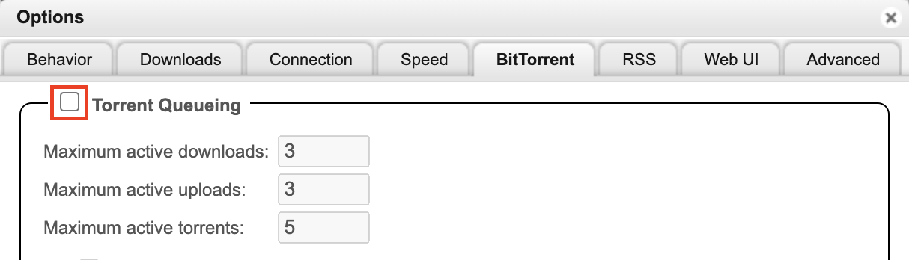
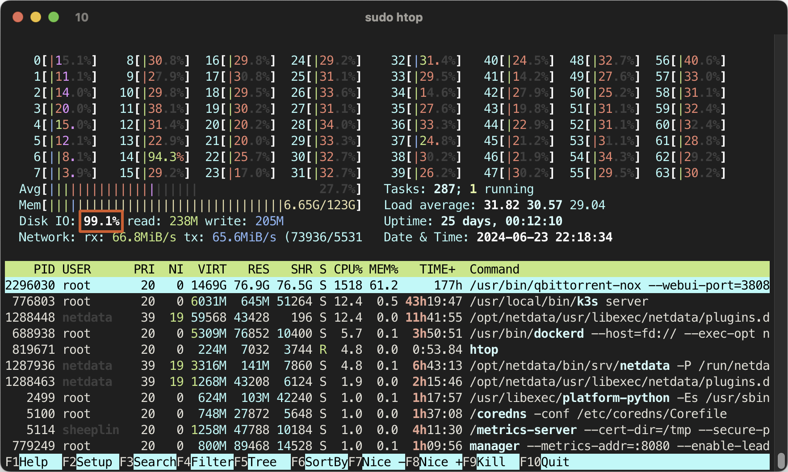
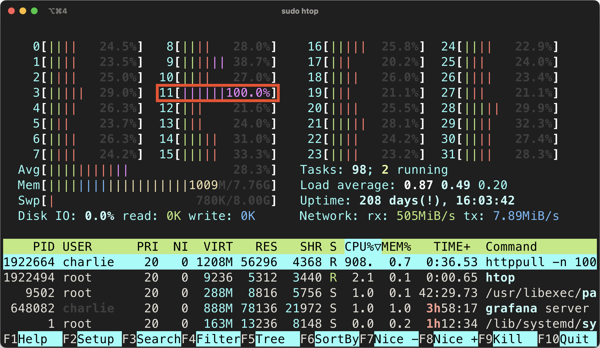
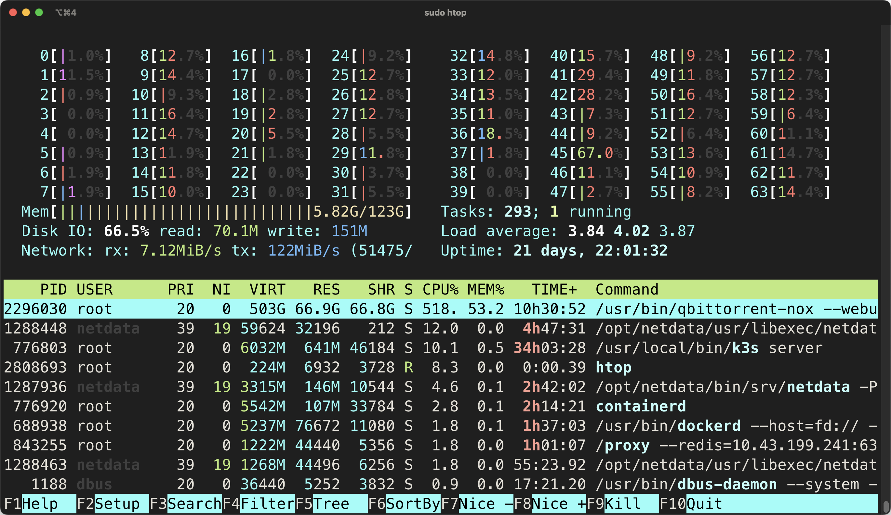
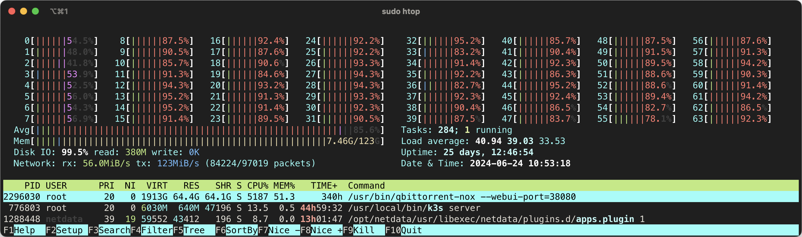
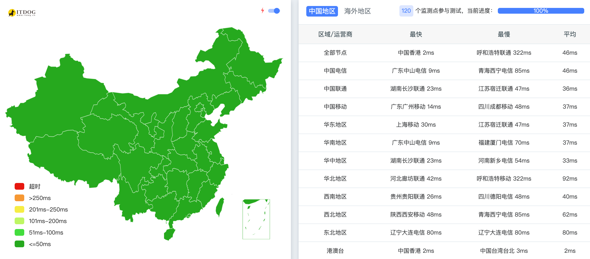

## 前言

由于最近接入了 10Gbps 网络，发现在 PT 做种时，传输速度并没有达到预期的速度，于是优化了一波。本文记录了一些针对高速做种的建议、注意点和技巧。

## 硬件条件

### 足够快的网络

做种本质上就是网络传输，快速的网络是做种的基础。

#### 确保上传带宽

做种嘛，主要是给别人传输数据，吃的是你的上传带宽，跟下载几乎没有关系，这是最重要的。例如原本 50Mbps 的上传情况下，买一条 100Mbps 的宽带比以下所有的优化都重要。

但是在中国，一般来说家庭宽带的上行速度都是比较低的。例如，电信的 1000M 宽带，上行速度一般不会超过 100Mbps，通常在 50Mbps 左右。这样的话，你的上传速度就被限制在 6.25MB/s 左右，在这个速度下，其实最主要的瓶颈在于你的上传带宽上，不太需要下面说的硬件/软件优化🫠。你可能需要找不少资源来找到高上传带宽的宽带，例如某些地区的移动宽带会给 IPv6 相当大的上传。你还要注意如何不被运营商认为是 PCDN 而封你的号。

由于本文聊的是高速做种，针对的是接近 1Gbps 的上传带宽的用户。国外的情况暂且不讨论（高速宽带价格更低，很容易购买到超过 1Gbps 的云服务器、seeding box 等），在国内，拥有高速上传带宽的用户主要有几种情况：

- 企业用户（例如大型公司、数据中心等），使用价格高昂，上下对等（即下载和上传速度一样快），租云服务器也属于这个范畴；
- 高校用户，使用价格较低（对用户来说，对学校来说不是这回事），上下对等；
- 其他特殊用户，例如某些地区的移动家庭宽带，500M 宽带上行可以达到 200M。

如果你是这些用户，那么你的上传带宽可能会达到 1Gbps 甚至更高，这时候就需要考虑下面的硬件/软件优化了。不过估计阅读本文的人大部分是高校教育网用户，低廉的价格超大的上传带宽（

在本文中，我的接入网络为上下 10Gbps 的教育网 CERNET 对等接入。


#### 外界可联通

大部分情况下，你做种时是别人主动连接你的，所以你的网络需要是可被连接的。

对于 IPv4 来说：

- 最好的情况是你拥有一个独立的公网 IP ，这是最简单的情况。如果公网 IP 在你的网卡上，那么你不需要做任何设置。如果公网 IP 在你家的光猫上，那么通过简单的端口映射/UPnP 等就能完成。这种情况国内不常见。
- 其次如果你的网络是 NAT1（全锥形 NAT） 的（指国内运营商级 NAT，一般你的光猫上能获取 100.x.x.x 这样的 IP），那么通过一些复杂的奇技淫巧（例如 UDP hole punching）也能实现可被连接。
- 最差的情况是你的网络是 NAT4（对称形 NAT） 的，这种情况下，你的网络是不可被连接的，除非你使用一些中继服务器来帮助你穿透。不过这种情况下，因为中继服务器的带宽有限，通常不能达到高速做种的要求，这里不讨论。

如何判断你是 NAT1 还是 NAT4 ？你可以使用 [pystun3](https://github.com/talkiq/pystun3)。

如果你使用 IPv6 做种（常见于教育网），运营商（学校）下发的 IPv6 地址一般都是公网 IP，不需要做任何设置，等同于情况一。

如果你不确定自己的网络是否可被连接，可以阅读文末注意点。

#### Peering

在数 Gbps 的高速网络下，你所在的运营商网络和你的种子的 peer 之间的连通性也值得考虑（但没那么重要）。运营商各张网之间，例如电信的 163 骨干网，教育网 CERNET ，甚至国外的运营商等，他们之间互联需要走 BGP ，如果你和你需要连接的用户之间连通性不好，那么你的上传速度可能会受到影响。

国内一般不需要考虑，这种一般在跨国传输的情况下比较明显，如果你所在的网的国际出口带宽不够，连接国外的 peer 时你会发现你的上传速度上不去。

### 足够快的硬盘

重要性仅次于网络的是硬盘速度，尤其关注 **随机读**。一种常见的错误认知是：我的机械硬盘顺序读能有 200MiB/s 那么我就能吃满 1Gbps 的上传带宽应该轻轻松松吧。这是完全错误的，由于做种会产生大量的 **随机读** ，机械硬盘在这方面是最弱鸡的。

例如，在 1Gbps 左右上传，大文件做种（活跃数据超过我的内存大小 128GB ）的情况下，能稳定 10k IOPS 直达我的磁盘的读取（例如下图 14k IOPS 的读）。一块 7200 RPM 的 SATA 机械硬盘也就 100 IOPS ，一块 15000RPM 的 SAS 机械硬盘也就 200 IOPS 左右，这有着快 2 个数量级的差距。所以，如果你的硬盘是机械硬盘（HDD, spinning rust :p），建议放弃治疗，一旦内存缓存不够了你的上传速度就 gg 了，这辈子都不可能吃满 1Gbps 的，500Mbps 都够呛。根据我的经验， 3*8TB 的 7200RPM 企业级 HDD RAID5 在活跃数据超过内存缓存（128GB）的情况下也就勉勉强强能吃 200Mbps 的上传带宽（此时磁盘已经 100% busy 了），如果缓存更小的话这个数值甚至更低。

注意：这里不考虑完全使用内存缓存（因为大部分人都没有几百 GB 的内存）一旦种子活跃数据超过可用的内存缓存大小，硬盘就是你的上传速度的瓶颈。


**所以高速做种的场景下一定要用 SSD ，最次也需要是 SATA SSD，建议使用更高性能的 NVME SSD 。**

本文使用了 3 块 Micron 5400 PRO 1.92TB 的 SSD 组成的 RAID5 。注意，这对于我的网络接入（10 Gbps）的情况下仍然是远远不够的，正常需要高性能 NVME SSD 才行。不过我大部分情况也就 1Gbps 左右，跑不满 10Gbps ，凑合用吧。


如果你不确定你的硬盘是否足够快，那么你可以阅读下文判断磁盘 IO 瓶颈的部分。

### 足够大的内存

足够大的内存可以提供：

- 更大的磁盘缓存，减少磁盘压力（高速上传时，SSD 也不一定能跟上）；
- 更大的 send buffer ，提高网络传输效率/IO 吞吐；

一般来说 32GB 左右能够满足需求，本文中使用了 128GB 内存测试。


### 足够快的网卡

更好的网卡能够提供更多的 hardware offloading ，减轻 CPU 的负担，提高网络传输效率。一些高端网卡也支持更多的 queue ，提高并发传输能力，例如 CX-4 Lx 支持 64 个 queue ，可以看到这些 queue 上的收发包表示它们在被积极利用（实际上一般软件无法同时用不到这么多，包括 qBittorrent，所以 8 队列的 I350 就够了）。


最差也要使用 Intel 的 Gigabit 网卡，例如 I350 、I210 ，更好的可以用 Intel X520/X540 ，甚至 Mellanox ConnectX-4/5/6 等更高端的网卡。不要用 Realtek （小螃蟹）的，在大连接数吃满 1Gbps 的情况下性能很烂。

例如下图是我的计算机在 700Mbps 下行 1.2Gbps 上行时每秒的收发包数量，约为 170 Kpps 。性能差的网卡是很难达到这个性能的。


本文中使用了 Mellanox ConnectX-4 Lx 25G (CX4121A) 网卡（虽然现在被 NVIDIA 收购了，不过我还是习惯称之为 Mellanox ）。


### 足够快的 CPU

一个正常的现代 CPU 即可，例如 Intel Core i5-12500 。请不要使用树莓派、老掉牙的 CPU（例如 Intel Xeon E5-2403 v2 这种 4C4T 1.8GHz 的垃圾），这种情况下，你的 CPU 仍然是整个系统的瓶颈，特别是在高速上传时，CPU 的负载会很高。网卡越烂，上传速度越快，你就需要越好的 CPU 来处理。

本文中使用了国产的飞腾 2000+ ，虽然看起来有 64 个 ARM64 核心，但是性能还是比较烂的，不太够说实话，用起来跟只有 10 个核的 i9-10900K 也差的比较多。

```
Architecture:                       aarch64
CPU op-mode(s):                     64-bit
Byte Order:                         Little Endian
Address sizes:                      44 bits physical, 48 bits virtual
CPU(s):                             64
On-line CPU(s) list:                0-63
Thread(s) per core:                 1
Core(s) per socket:                 64
Socket(s):                          1
NUMA node(s):                       8
Vendor ID:                          Phytium
BIOS Vendor ID:                     Phytium
Model:                              2
Model name:                         FTC662
BIOS Model name:                    FT-2000+/64
Stepping:                           0x1
BogoMIPS:                           100.00
L1d cache:                          2 MiB
L1i cache:                          2 MiB
L2 cache:                           512 MiB
NUMA node0 CPU(s):                  0-7
NUMA node1 CPU(s):                  8-15
NUMA node2 CPU(s):                  16-23
NUMA node3 CPU(s):                  24-31
NUMA node4 CPU(s):                  32-39
NUMA node5 CPU(s):                  40-47
NUMA node6 CPU(s):                  48-55
NUMA node7 CPU(s):                  56-63
Flags:                              fp asimd evtstrm crc32 cpuid
```

## 软件调优

### qBittorrent

#### 基本设置

- 提升连接限制。如果你的网络/磁盘足够强劲，你可以去除所有的连接限制：


- 提高队列。磁盘性能足够的情况下，可以同时让多个种子做种，你也可以直接关闭：



- 提高内存限制。虽然目前（2024 年 6 月）这个设置只对 Windows 有效，不过设置了也无妨：


#### libtorrent 调优

我们针对 libtorrent >=2.0 版本，1 Gbps 左右的对等带宽， 64G 左右内存的用户，其他用户请酌情调整以下参数。

- `aio_threads` *Asynchronous I/O threads* 默认 10 。例如在高速下载时，由于需要把下载的数据都坐 SHA1/SHA256 校验，CPU 可能存在瓶颈。提高这个值可以减轻让多核 CPU 并行处理。常见的说法是设置为 4 *线程数 。由于我使用了 64 核的处理器，256 显得过大了，所以我设置为 64 。
- `file_pool_size` *File pool size* 默认 40。一个 session 直接同时打开多少个文件。大量做种时，这个值设置的太小会导致频繁的文件打开/关闭，降低性能。而又设置的太大会超过一个进程的文件描述符限制（ulimit -n），导致打开文件失败。我设置为 900 （Linux 默认的文件描述符限制是 1024），留一些给其他的文件使用。
- `max_queued_disk_bytes` *Disk queue size* 默认 1024 KiB 。这个值表示磁盘 IO 写入队列的大小，如果达到了这个上限，libtorrent 就会停止下载，直到磁盘完成了一部分写入。这个值设置的太小会导致下载性能下降，设置的太大会导致内存占用过高。我设置为 262144 KiB 。
- `default-disk-io-constructor` *Disk IO type* 默认 `mmap_disk_io_constructor` 。这个值表示 libtorrent 使用的磁盘 IO 类型，`posix_disk_io_constructor` 是使用 POSIX IO ，`mmap` 是使用 mmap ，mmap 在 kernel 里有大量优化，建议只用 mmap （Memory Mapped Files）。如果你看到了大量内存占用，请看文末注意点。
- `disk_io_write_mode` 和 `disk_io_read_mode` 默认 `enable_os_cache` 。维持默认。
- `piece_extent_affinity` *Use piece extent affinity* 默认 `0` 。这个值表示 libtorrent 会尽量下载相邻的 piece ，提高磁盘 IO 吞吐。建议打开。
- `suggest_mode` *Send upload piece suggestions* 默认 `no_piece_suggestions` 。这个值表示会告诉从我这边下载的 peer 建议下载那些在我读缓存里的 piece 而不是其他的没在缓存里的，可以提高做种速度减少磁盘 IO 。建议打开。
- `send_buffer_low_watermark` *Send buffer low watermark* 默认 10 KiB。最小的目标 send buffer 大小（包括等待磁盘读取的字节数）。这实际上是初始窗口大小，它决定了我们能够多快地提高发送速率。我设置为 4096 KiB。
- `send_buffer_watermark` *Send buffer watermark* 默认 500 KiB。如果发送缓冲区的字节数少于它，将从磁盘额外读取 16 KiB 的数据到缓冲区。这是上限，所以实际大小可能小于它。过小影响上传速率，过大浪费内存。我设置为 32768 KiB。
- `send_buffer_watermark_factor` *Send buffer watermark factor* 默认 50。这是个百分比，peer 的上传速率乘以这个因子以获得 实际的 send_buffer_watermark，但是不超过上面的 send_buffer_watermark。对于高速连接，设置得更高可以提高上传性能和磁盘吞吐，设置得过高可能会浪费内存并且偏好读。我的目的是高速做种，我设置为 200。
- `connection_speed` *Outgoing connections per second* 默认 30。这个值表示每秒最多建立多少个出站连接，影响去下载 peer 那边数据的效率。我设置为 500 。
- `listen_queue_size` *Socket backlog size* 默认 5 。它是传递给监听 socket listen() 的值，用于指定未处理传入连接的队列长度。当我们不积极等待连接被接受时，这些连接将会被排队。由于我们是大带宽高性能做种，我设置为 3000。
- `mixed_mode_algorithm` *μTP-TCP mixed mode algorithm* 默认 `prefer_tcp` 。这个值用于确定在同时存在 TCP 和 uTP 连接时如何处理这两种连接。我们不需要为 uTP 做出让步，所以设置为 `prefer_tcp` 。
- `allow_multiple_connections_per_ip` *Allow multiple connections from the same IP address* 默认 `true` 。这个值表示是否允许同一个 IP 建立多个连接。我们不需要限制，所以设置为 `true` 。
- `choking_algorithm` *Upload slots behavior* 使用 `fixed_slots_choker`。
- `seed_choking_algorithm` *Upload choking algorithm* 使用 `fastest_upload`。
- `max_out_request_queue` *Maximum outstanding requests to a single peer* 默认 500 。表示发给 peer 的最大未处理请求数。我设置为 2000 。

### 自动下载/自动 Announce

一般种子流量最大的时候为刚发布之后，为了在种子发布后能够快速下载，抢占最早的上传机会。我们需要自动下载种子，然后立即开始做种。称之为 [racing](https://www.reddit.com/r/seedboxes/comments/9brx3b/comment/e570unm/) 。

这里我使用了自己编写的脚本，你也可以用 autodl-irssi 等工具。

## 注意点

### 判断磁盘 IO 瓶颈

使用 `iostat -xm 1`，找到存放种子数据的盘，特别关注最后的百分比，接近 100% 表示你的磁盘是瓶颈了。


你也可以在 htop 中看到 IO 的情况（在 Setup 的 Meter 中添加 Disk IO ）。htop 中的百分比是所有磁盘的合计，如果的下载盘是软 RAID 你有可能看到超过 100% 的情况，我这里是单个设备（硬 RAID），所以图中 99.1% 表示 IO 已经满了，我的硬盘已经跟不上了。



上面两张图是我使用的 3 块 SSD 阵列在 1~2 Gbps 上传，IO 爆发时的情况，可以看到其实 IO 已经快满了。如果你发现你的 busy% 接近 100% 了，那么你的磁盘 IO 就是瓶颈了，建议更换更好更快的 SSD。

如果你用的是机械硬盘，应该是轻轻松松全程 100% ，完全撑不住 :p

### 判断网络 IO 瓶颈

首先查看你的上传/下载速度是否超过了你的互联网带宽/物理网络接口的速度。你可以在 htop 中看到（记得在 Setup -> Meters 中添加 Network IO ）如果超过了，那么没什么办法，除非换网络/换网卡。如果没有，可以继续往下看。


如果你看到 softirq 占用过高，那么你的网络 IO 可能是瓶颈了，建议更换更好的 CPU 或网卡。

例如你可以在 htop 中看到紫色的 softirq 的占用（注意在 Setup -> Display Options 中勾选 Detailed CPU time ）。


如果你发现某个/几个核心的 softirq 占满了，那么你的网络 IO 可能是瓶颈了。



正常情况你不应该看到很高的 softirq 占用。



### 判断 CPU 瓶颈

一般来说，通过看 htop 即可。注意，你不仅要看全部的 CPU 核心占用，**还要看单个核心的占用**。如果你发现某个核占满了（这种情况更易发生）、整体 CPU 占用很高（目前 CPU 核心很多了，这个不太容易发生），那么你的 CPU 可能是瓶颈了。同时，看到 CPU 占用很高时，注意上面一节提到的 softirq 占用，这可能是网络 IO 的瓶颈。

例如在我的计算机上，我偶尔在 IO 爆发时能见到 CPU 占用 5000%+ 的峰值，这说明我的CPU对我的使用场景来说不太行。（图中其实你会发现我的磁盘IO也满了。。）



### qBittorrent 内存占用过大？

如果你发现 qBittorrent 的内存占用过大，你不应该担心。这是 mmap 的特性，它会把文件映射到内存中，这样可以减少磁盘 IO ，提高性能。如果你关注总的内存占用，你会发现它并不会增加。自从 libtorrnet 2.0 使用 mmap 以来，有很多用户 [反馈内存占用过大](https://github.com/arvidn/libtorrent/issues/6667) ，但是这是正常的。

例如我的计算机上，qBittorrent 的内存占用超过了 80GB ，但是总的内存占用只有 5GB。


### 检测是否可被连接

你可以使用外网 TCPing 来检查，例如一些网站可以替你检测： [IPv4](https://www.itdog.cn/tcping)、[IPv6](https://www.itdog.cn/tcping_ipv6) 。输入你的公网 IP 和端口，如果各地均能够 ping 通，那么你是可被连接的。



### 上传仍然不及预期？

如果你各方面都确认没有瓶颈（网络、磁盘、CPU 等）但是上传速度仍然很慢，那么可能是你的种子不够热门，或者说你的 peer 的下行太慢了。这方面除了选择热门的种子（做种人少，下载人多，提高下载的 peer 连接你的机会），其实也没什么办法了。

因为你的上传是需要 peer 来连接你的，这就不是你能决定的事，可遇而不可求。举个例子，如果想跑满 10Gbps 的上传，那么需要 10 个 peer ，每个都以 1Gbps 的速度从你这拉数据，这是非常困难的。首先，别人的下载速度很少有 1G 的；其次，做种的人几十个，别人不可能只从你这下载，很可能从几十个不同的 peer 那边下载，一下就分散了，一个 peer 到你这只有几十分之一的流量了。

所以，这种情况下，除了选择合适的种子提高 peer 连接你的机会也没什么办法了。合适的种子通常是刚发布、热门、做种人少、下载人多的种子。
