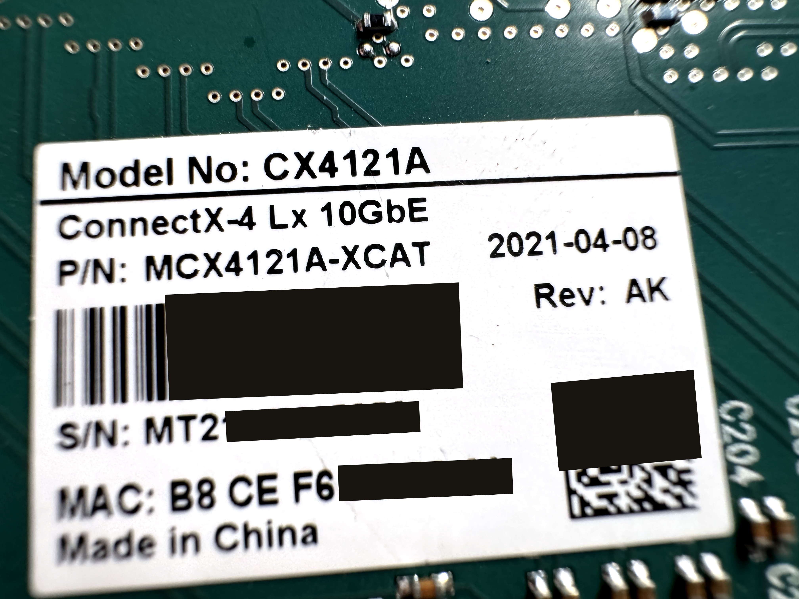

10G ConnectX-4 Lx NICs can be flashed to 25G with the right firmware. This is useful if you have a 10G NIC and want to upgrade to 25G without buying a new NIC. This article will guide you through the process of flashing a 10G Mellanox ConnectX-4 Lx NIC to 25G.

Warning: Do not try this on MCX4121C. It will brick the NIC.

1. Download firmware from [Firmware for ConnectX®-4 Lx EN](https://network.nvidia.com/support/firmware/connectx4lxen/). Choose `MCX4121A-ACUT`. I will assume the firmware file is named `fw-ConnectX4Lx-rel-14_32_1010-MCX4121A-ACU_Ax-UEFI-14.25.17-FlexBoot-3.6.502.bin`.

   If you are wondering what's the difference between models, here's a table for ConnectX-4 Lx cards ([original document](files/pb-connectx-4-lx-en-card.pdf)). You should choose 25G models to flash to.

   | Max Network Speed | Interface Type | Supported Ethernet  Speeds (GbE) | Host Interface | Additional Features           | OPN           |
   | ----------------- | -------------- | -------------------------------- | -------------- | ----------------------------- | ------------- |
   | 1x 10GbE          | SFP28          | 10, 1                            | PCIe 3.0 x8    |                               | MCX4111A-XCAT |
   | 2x 10GbE          | SFP28          | 10, 1                            | PCIe 3.0 x8    |                               | MCX4121A-XCAT |
   | 2x 10GbE          | SFP28          | 10, 1                            | PCIe 3.0 x8    | Host Management, UEFI Enabled | MCX4121A-XCHT |
   | 1x 25GbE          | SFP28          | 25, 10, 1                        | PCIe 3.0 x8    |                               | MCX4111A-ACAT |
   | 1x 25GbE          | SFP28          | 25, 10, 1                        | PCIe 3.0 x8    | UEFI Enabled                  | MCX4111A-ACUT |
   | 2x 25GbE          | SFP28          | 25, 10, 1                        | PCIe 3.0 x8    |                               | MCX4121A-ACAT |
   | 2x 25GbE          | SFP28          | 25, 10, 1                        | PCIe 3.0 x8    | UEFI Enabled                  | MCX4121A-ACUT |
   | 1x 40GbE          | QSFP28         | 40, 25, 10, 1                    | PCIe 3.0 x8    |                               | MCX4131A-BCAT |
   | 1x 50GbE          | QSFP28         | 50, 40, 25, 10, 1                | PCIe 3.0 x8    |                               | MCX4131A-GCAT |

2. Download and install [NVIDIA Firmware Tools (MFT)](https://network.nvidia.com/products/adapter-software/firmware-tools/).

3. `mst start`

4. `mst ststus` You will see you MST device, e.g. `/dev/mst/mt4117_pciconf0`. I will use this device path in this article. If your path differs from this, please change it accordingly.

5. Save GUID, MAC: `flint -d /dev/mst/mt4117_pciconf0 query full > flint_query.txt`

6. Save hardware info: `flint -d /dev/mst/mt4117_pciconf0 hw query > flint_hwinfo.txt`

7. Save current firmware: `flint -d /dev/mst/mt4117_pciconf0 ri orig_firmware.bin`

8. Save current firmware config: `flint -d /dev/mst/mt4117_pciconf0 dc orig_firmware.ini`

9. Save current PXE ROM (if exists): `flint -d /dev/mst/mt4117_pciconf0 rrom orig_rom.bin`

10. Save current PCI VPD: `mlxburn -d /dev/mst/mt4117_pciconf0 -vpd > orig_vpd.txt`

11. `flint -i fw-ConnectX4Lx-rel-14_32_1010-MCX4121A-ACU_Ax-UEFI-14.25.17-FlexBoot-3.6.502.bin verify`

12. `flint -i fw-ConnectX4Lx-rel-14_32_1010-MCX4121A-ACU_Ax-UEFI-14.25.17-FlexBoot-3.6.502.bin -d /dev/mst/mt4117_pciconf0 -allow_psid_change burn`

Reboot you machine. You should see your NIC is now have 25G speed.

Bonus:

- To change MAC address: `flint -d /dev/mst/mt4117_pciconf0 -mac 02c90abcdef0 sg`
- To change GUID: `flint -d /dev/mst/mt4117_pciconf0 -guid 0002c9000abcdef0 sg`
