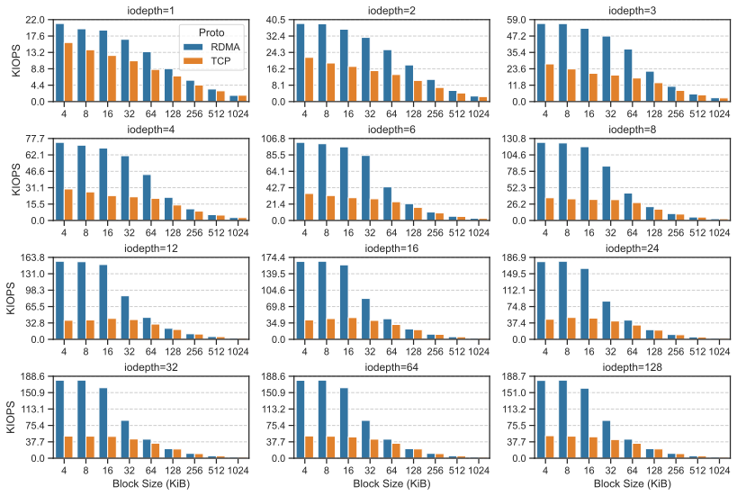
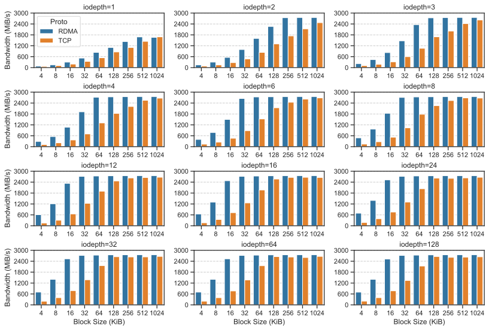

So I decided to test NFS over RDMA somehow.

| Hostname | `ft2000` (Server)            | `t3640` (Client)             |
| -------- | ---------------------------- | ---------------------------- |
| CPU      | Phytium FT-2000+/64          | Intel Core i9-10900K         |
| RAM      | Quad Channel DDR4 128GB      | Dual Channel DDR4 64GB       |
| NIC      | Mellanox ConnextX-4 Lx 25GbE | Mellanox ConnextX-4 Lx 25GbE |
| OS       | UOS Server 20 1070a          | Debian 12                    |

Two servers are connected using a 25GbE network. The goal is to set up NFS over RDMA and benchmark it to see the performance difference between NFS over TCP and NFS over RDMA.


## RDMA Link Verification

> Sopiler: Do not use Mellanox OFED (can be seen from `ofed_info -s`) if you want to use NFSoRDMA. It is not supported after version 3.4. Use inbox OS driver instead. So if you are using Mellanox OFED, you need to uninstall it now (a `uninstall.sh` is provided in the Mellanox OFED installation directory).
> 
> I personally ran into this issue when I tried to set up NFSoRDMA on my servers and found NFSoRDMA is not supported so I had to use the inbox OS driver and start over. You can continue reading to see what errors I encountered.

**Install RDMA/IB dependencies:**

Dependencies should be the same on both devices (no server and client differences). The difference is only the package manager (and OS).

On UOS Server 20 1070a, which is Anolis8-based, which is again CentOS8-based:

```console
root@ft2000:/# yum install -y libibverbs librdmacm opensm-libs rdma-core rdma-core-devel \
    librdmacm-utils opensm-static srp_daemon ucx-devel ucx-rdmacm infiniband-diags ibacm \
    opensm-devel ucx ucx-ib libibumad opensm mstflint ucx-cma openmpi rshim libibverbs-utils \
    perftest rdma-core rdma-core-devel infiniband-diags rshim
```

On Debian 12:

```console
root@t3640:/# apt install -y infiniband-diags srptools perftest opensm-doc librdmacm-dev \
    rdmacm-utils librdmacm1 ibacm libibmad-dev libibmad5 libibumad-dev libibumad3 \
    ibverbs-utils libibverbs-dev libibverbs1 mstflint rdma-core opensm fio librbd1 \
    librados2 libibnetdisc5 ibverbs-providers
```

**Make sure link is up on both servers using `ip` or `ibstatus` command:**

Client:

Use `ip` (note `state UP`):

```console
root@t3640:/# ip l show dev enp1s0f1np1
6: enp1s0f1np1: <BROADCAST,MULTICAST,UP,LOWER_UP> mtu 1500 qdisc mq state UP mode DEFAULT group default qlen 1000
```

Or use `ibstatis` (note `phys state: 5: LinkUp`):

```console
root@t3640:/# ibstatus
Infiniband device 'mlx5_0' port 1 status:
	default gid:	 fe80:0000:0000:0000:ee0d:9aff:fed9:8ff6
	base lid:	 0x0
	sm lid:		 0x0
	state:		 4: ACTIVE
	phys state:	 5: LinkUp
	rate:		 10 Gb/sec (1X QDR)
	link_layer:	 Ethernet

Infiniband device 'mlx5_1' port 1 status:
	default gid:	 fe80:0000:0000:0000:ee0d:9aff:fed9:8ff7
	base lid:	 0x0
	sm lid:		 0x0
	state:		 4: ACTIVE
	phys state:	 5: LinkUp
	rate:		 25 Gb/sec (1X EDR)
	link_layer:	 Ethernet
```

Server:

Use `ip` (note `state UP`):

```console
root@ft2000:/# ip l show dev enp16s0f0np0
4: enp16s0f0np0: <BROADCAST,MULTICAST,UP,LOWER_UP> mtu 1500 qdisc mq state UP mode DEFAULT group default qlen 1000
```

Or use `ibstatis` (note `phys state: 5: LinkUp`):

```console
root@ft2000:/# ibstatus
Infiniband device 'mlx5_0' port 1 status:
	default gid:	 fe80:0000:0000:0000:bac7:d5ff:fe7f:cc05
	base lid:	 0x0
	sm lid:		 0x0
	state:		 4: ACTIVE
	phys state:	 5: LinkUp
	rate:		 25 Gb/sec (1X EDR)
	link_layer:	 Ethernet

Infiniband device 'mlx5_1' port 1 status:
	default gid:	 fe80:0000:0000:0000:bac7:d5ff:fe7f:cc06
	base lid:	 0x0
	sm lid:		 0x0
	state:		 1: DOWN
	phys state:	 3: Disabled
	rate:		 40 Gb/sec (4X QDR)
	link_layer:	 Ethernet
```

**Verify IP connectivity between the servers (ping the IP address of the other server):**

```console
root@t3640:/# ping 192.168.23.1
PING 192.168.23.1 (192.168.23.1) 56(84) bytes of data.
64 bytes from 192.168.23.1: icmp_seq=1 ttl=64 time=0.199 ms
64 bytes from 192.168.23.1: icmp_seq=2 ttl=64 time=0.206 ms
```

**Make sure the the InfiniBand kernel modules are enabled.**

```console
# On both servers
root@ft2000:/# lsmod | grep ^ib
ib_srpt               262144  0
ib_isert              262144  0
ib_iser               262144  0
ib_umad               262144  0
ib_ipoib              327680  0
ib_cm                 262144  3 rdma_cm,ib_ipoib,ib_srpt
ib_uverbs             327680  2 rdma_ucm,mlx5_ib
ib_core               458752  12 rdma_cm,ib_ipoib,rpcrdma,ib_srpt,iw_cm,ib_iser,ib_umad,ib_isert,rdma_ucm,ib_uverbs,mlx5_ib,ib_cm
```

**Make sure you have a lossless network:**

In case the RDMA is running over Ethernet (RoCE) you need to make sure that the network is configured to be loss-less, which means that either flow control (FC) or priority flow control PFC is enabled on the adapter ports and the switch.

In case of lab environment or small setup, you can use Global Pause Flow Control to create loss-less environment. To check what is the global pause configuration use the following command (by default it is enabled normally).

```console
root@t3640:/# ethtool -a enp1s0f0np0
Pause parameters for enp1s0f0np0:
Autonegotiate:	off
RX:		on
TX:		on
```

In case it is disabled, run:
```console
root@t3640:/# ethtool -A enp1s0f0np0 rx on tx on
```

**Test RDMA speed. Refer to my previous blog [InfiniBand Performance Test](../ib-perf-test) for details.**

Run the following command on client and server, respectively:

```console
root@t3640:/# ib_send_bw --report_gbit -a -F -d mlx5_1
# device name can be seen in `ibstatus` command
```

```console
root@ft2000:/# ib_send_bw --report_gbit -a -F -d mlx5_0 192.168.23.2
---------------------------------------------------------------------------------------
                    Send BW Test
 Dual-port       : OFF		Device         : mlx5_0
 Number of qps   : 1		Transport type : IB
 Connection type : RC		Using SRQ      : OFF
 PCIe relax order: ON
 ibv_wr* API     : ON
 TX depth        : 128
 CQ Moderation   : 100
 Mtu             : 1024[B]
 Link type       : Ethernet
 GID index       : 3
 Max inline data : 0[B]
 rdma_cm QPs	 : OFF
 Data ex. method : Ethernet
---------------------------------------------------------------------------------------
 local address: LID 0000 QPN 0x0087 PSN 0x176d37
 GID: 00:00:00:00:00:00:00:00:00:00:255:255:192:168:23:01
 remote address: LID 0000 QPN 0x0188 PSN 0x789e84
 GID: 00:00:00:00:00:00:00:00:00:00:255:255:192:168:23:02
---------------------------------------------------------------------------------------
 #bytes     #iterations    BW peak[Gb/sec]    BW average[Gb/sec]   MsgRate[Mpps]
 2          1000           0.029629            0.028911            1.806916
 4          1000           0.059258            0.056530            1.766561
 8          1000             0.12               0.12   		   1.822011
 16         1000             0.24               0.23   		   1.814474
 32         1000             0.47               0.47   		   1.827926
 64         1000             0.95               0.92   		   1.803978
 128        1000             2.23               2.14   		   2.087232
 256        1000             4.65               4.51   		   2.202802
 512        1000             6.83               6.70   		   1.635296
 1024       1000             13.65              13.21  		   1.612778
 2048       1000             23.41              22.54  		   1.375834
 4096       1000             23.08              22.96  		   0.700620
 8192       1000             23.08              23.06  		   0.351821
 16384      1000             23.16              23.10  		   0.176238
 32768      1000             23.16              23.12  		   0.088211
 65536      1000             23.14              23.13  		   0.044119
 131072     1000             23.15              23.14  		   0.022069
 262144     1000             23.15              23.14  		   0.011036
 524288     1000             23.15              23.15  		   0.005518
 1048576    1000             23.15              23.15  		   0.002759
 2097152    1000             23.15              23.15  		   0.001380
 4194304    1000             23.15              23.15  		   0.000690
 8388608    1000             23.15              23.15  		   0.000345
---------------------------------------------------------------------------------------
```

As you can see, the speed is around 23 Gb/sec. This is the maximum speed of the network (25G). If you see a lower speed, you need to check the network configuration and the switch configuration.


## Configure NFS without RDMA

Just to make sure NFS is working.

**Install NFS on server:**

```console
root@ft2000:/# yum -y install nfs-utils # On Debian: apt install nfs-kernel-server
root@ft2000:/# systemctl start nfs-server rpcbind
root@ft2000:/# systemctl enable nfs-server rpcbind
```

**Use `/tmp` as a test dir and share it:**

Since I want to test the network performance (TCP and RDMA), I don't want to be bottlenecked by the disk speed. So I will use `/tmp`, which is backed by RAM, as a reasonably fast directory to avoid bottlenecks.

```console
root@ft2000:/# echo '/tmp *(rw,async,insecure,no_root_squash)' >>/etc/exports
```

**Make it available:**

```console
root@ft2000:/# exportfs -a
root@ft2000:/# systemctl restart nfs-server
```

**Install NFS on client:**

```console
root@t3640:/# apt install nfs-common
```

**Mount the NFS share temporarily:**

```console
root@t3640:/# mkdir -p /mnt/nfs
root@t3640:/# mount -t nfs 192.168.23.1:/tmp /mnt/nfs
```

**Verify the mount:**

Should see the files in `/tmp` on the server.

```console
root@t3640:/# ls -l /mnt/nfs
```


## Configure NFS with RDMA

**Load RDMA transport module on the server:**

```console
root@ft2000:/# modprobe svcrdma
# To make it permanent: echo 'svcrdma' >>/etc/modules
root@ft2000:/# systemctl restart nfs-server
```

**Instruct the server to listen on the RDMA transport port (20049 is the default port):**

Note: if you see `echo: write error: protocol not supported`, it means that the NFSoRDMA is not supported in the Mellanox OFED version 3.4 and higher. You need to use the inbox OS driver (refer to *Install RDMA/IB dependencies* section in this blog). I was tripped by this issue.

```console
root@ft2000:/# echo rdma 20049 > /proc/fs/nfsd/portlist
```

**Load the RDMA transport module on the client**

```console
root@t3640:/# modprobe xprtrdma
# To make it permanent: echo 'xprtrdma' >>/etc/modules
root@t3640:/# systemctl restart nfs-utils.service
```

**Mount the NFS share with RDMA:**

Before running the mount command, unmount the NFS share if it is mounted (`umount /mnt/nfs`).

```console
root@t3640:/# mount -t nfs -o rdma,port=20049 192.168.23.1:/tmp /mnt/nfs
```

**Check the mount parameters:**

If you see `proto=rdma`, it means the NFS is mounted using RDMA.

```console
root@t3640:/# nfsstat -m
/mnt/nfs from 192.168.23.1:/tmp
 Flags:	rw,relatime,vers=4.2,rsize=1048576,wsize=1048576,namlen=255,hard,proto=rdma,port=20049,timeo=600,retrans=2,sec=sys,clientaddr=192.168.23.2,local_lock=none,addr=192.168.23.1
```

**Verify the mount:**

Should see the files in `/tmp` on the server.

```console
root@t3640:/# ls -l /mnt/nfs
```

## Benchmark

Use `fio` to benchmark the NFS performance. Parameters such as `bs`, `iodepth` will be changed to different values later to evaluate the performance in different scenarios.

I will only test **random read** performance since sequential read performance is not a main concern even using TCP let alone RDMA.

The actual command will be:

```console
root@t3640:/# fio --rw=randread --bs=4k --numjobs=1 --iodepth=1 --runtime=10 --time_based --loops=1 \
    --ioengine=libaio --direct=1 --invalidate=1 --fsync_on_close=1 --randrepeat=1 --norandommap \
    --exitall --name task1 --filename=/mnt/nfs/testfile --size=256M
```

> The full log and related scripts can be found in the [Appendix](#appendix).

Here are the results we have all been waiting for!

For IO operations per second (IOPS), the average IOPS for NFS over RDMA is higher than NFS over TCP. The difference is more significant when the block size is larger and the most significant when `iodepth=12`. We can also see that no matter the block size and iodepth, the IOPS for NFS over TCP is capped at around 47 KIOPS, while the one of RDMA is significantly higher at over 180 KIOPS.

The reason why the difference is smaller with larger block sizes is that the network bandwidth is the bottleneck. For our 25GbE network, the maximum bandwidth is around 2800 MiB/s. We are hitting this limit with larger block sizes and this much IOPS. This is unrelated to the RDMA or TCP. If you have a faster network, you will see this difference for larger block sizes as well.

For 4K block size:

| IO Depth | KIOPS (RDMA) | KIOPS (TCP) | Ratio |
| ----------- | ---------- | ----- | ---- |
| 8 | 124.5 | 36.1 | 3.4 |
| 12 | 156.0 | 38.1 | 4.1 |
| 16 | 165.8 | 41.4 | 4.0 |
| 24 | 177.0 | 45.8 | 3.9 |
| 32 | 179.4 | 50.7 | 3.5 |



For bandwidth, the average bandwidth for NFS over RDMA is significantly higher (around 4x for small block sizes). 

The reason why the difference is more significant when the block size is small (4-16) is that we are limited by the network bandwidth. Since we have a 25GbE network, the maximum bandwidth is around 2800 MiB/s so you can see that the bandwidth is capped at 2800 MiB/s for large block sizes and deep IO depths. If you have a faster network, you will see this 4x difference for larger block sizes as well.



Latency-wise, the average latency for NFS over RDMA is slightly lower than NFS over TCP. The difference is more significant for small block size and large iodepths.


## Appendix

- Benchmark script [benchmark.sh](benchmark.sh): automatically run `fio` with different `bs` and `iodepth` values and saves logs (it saves stdout, not the fio-generated log, e.g. `--bandwidth-log`).
- Plotting script [plot.py](plot.py): parses the `fio` logs (stdout) saved by `benchmark.sh` and plots the results, which is the three figures you see above in the [Benchmark](#benchmark) section.

<details>
<summary>Raw fio Logs (Click to Show)</summary>

- [rdma_fio_bs4k_iodepth1.log](logs/rdma_fio_bs4k_iodepth1.log)
- [rdma_fio_bs4k_iodepth2.log](logs/rdma_fio_bs4k_iodepth2.log)
- [rdma_fio_bs4k_iodepth3.log](logs/rdma_fio_bs4k_iodepth3.log)
- [rdma_fio_bs4k_iodepth4.log](logs/rdma_fio_bs4k_iodepth4.log)
- [rdma_fio_bs4k_iodepth6.log](logs/rdma_fio_bs4k_iodepth6.log)
- [rdma_fio_bs4k_iodepth8.log](logs/rdma_fio_bs4k_iodepth8.log)
- [rdma_fio_bs4k_iodepth12.log](logs/rdma_fio_bs4k_iodepth12.log)
- [rdma_fio_bs4k_iodepth16.log](logs/rdma_fio_bs4k_iodepth16.log)
- [rdma_fio_bs4k_iodepth24.log](logs/rdma_fio_bs4k_iodepth24.log)
- [rdma_fio_bs4k_iodepth32.log](logs/rdma_fio_bs4k_iodepth32.log)
- [rdma_fio_bs4k_iodepth64.log](logs/rdma_fio_bs4k_iodepth64.log)
- [rdma_fio_bs4k_iodepth128.log](logs/rdma_fio_bs4k_iodepth128.log)
- [rdma_fio_bs8k_iodepth1.log](logs/rdma_fio_bs8k_iodepth1.log)
- [rdma_fio_bs8k_iodepth2.log](logs/rdma_fio_bs8k_iodepth2.log)
- [rdma_fio_bs8k_iodepth3.log](logs/rdma_fio_bs8k_iodepth3.log)
- [rdma_fio_bs8k_iodepth4.log](logs/rdma_fio_bs8k_iodepth4.log)
- [rdma_fio_bs8k_iodepth6.log](logs/rdma_fio_bs8k_iodepth6.log)
- [rdma_fio_bs8k_iodepth8.log](logs/rdma_fio_bs8k_iodepth8.log)
- [rdma_fio_bs8k_iodepth12.log](logs/rdma_fio_bs8k_iodepth12.log)
- [rdma_fio_bs8k_iodepth16.log](logs/rdma_fio_bs8k_iodepth16.log)
- [rdma_fio_bs8k_iodepth24.log](logs/rdma_fio_bs8k_iodepth24.log)
- [rdma_fio_bs8k_iodepth32.log](logs/rdma_fio_bs8k_iodepth32.log)
- [rdma_fio_bs8k_iodepth64.log](logs/rdma_fio_bs8k_iodepth64.log)
- [rdma_fio_bs8k_iodepth128.log](logs/rdma_fio_bs8k_iodepth128.log)
- [rdma_fio_bs16k_iodepth1.log](logs/rdma_fio_bs16k_iodepth1.log)
- [rdma_fio_bs16k_iodepth2.log](logs/rdma_fio_bs16k_iodepth2.log)
- [rdma_fio_bs16k_iodepth3.log](logs/rdma_fio_bs16k_iodepth3.log)
- [rdma_fio_bs16k_iodepth4.log](logs/rdma_fio_bs16k_iodepth4.log)
- [rdma_fio_bs16k_iodepth6.log](logs/rdma_fio_bs16k_iodepth6.log)
- [rdma_fio_bs16k_iodepth8.log](logs/rdma_fio_bs16k_iodepth8.log)
- [rdma_fio_bs16k_iodepth12.log](logs/rdma_fio_bs16k_iodepth12.log)
- [rdma_fio_bs16k_iodepth16.log](logs/rdma_fio_bs16k_iodepth16.log)
- [rdma_fio_bs16k_iodepth24.log](logs/rdma_fio_bs16k_iodepth24.log)
- [rdma_fio_bs16k_iodepth32.log](logs/rdma_fio_bs16k_iodepth32.log)
- [rdma_fio_bs16k_iodepth64.log](logs/rdma_fio_bs16k_iodepth64.log)
- [rdma_fio_bs16k_iodepth128.log](logs/rdma_fio_bs16k_iodepth128.log)
- [rdma_fio_bs32k_iodepth1.log](logs/rdma_fio_bs32k_iodepth1.log)
- [rdma_fio_bs32k_iodepth2.log](logs/rdma_fio_bs32k_iodepth2.log)
- [rdma_fio_bs32k_iodepth3.log](logs/rdma_fio_bs32k_iodepth3.log)
- [rdma_fio_bs32k_iodepth4.log](logs/rdma_fio_bs32k_iodepth4.log)
- [rdma_fio_bs32k_iodepth6.log](logs/rdma_fio_bs32k_iodepth6.log)
- [rdma_fio_bs32k_iodepth8.log](logs/rdma_fio_bs32k_iodepth8.log)
- [rdma_fio_bs32k_iodepth12.log](logs/rdma_fio_bs32k_iodepth12.log)
- [rdma_fio_bs32k_iodepth16.log](logs/rdma_fio_bs32k_iodepth16.log)
- [rdma_fio_bs32k_iodepth24.log](logs/rdma_fio_bs32k_iodepth24.log)
- [rdma_fio_bs32k_iodepth32.log](logs/rdma_fio_bs32k_iodepth32.log)
- [rdma_fio_bs32k_iodepth64.log](logs/rdma_fio_bs32k_iodepth64.log)
- [rdma_fio_bs32k_iodepth128.log](logs/rdma_fio_bs32k_iodepth128.log)
- [rdma_fio_bs64k_iodepth1.log](logs/rdma_fio_bs64k_iodepth1.log)
- [rdma_fio_bs64k_iodepth2.log](logs/rdma_fio_bs64k_iodepth2.log)
- [rdma_fio_bs64k_iodepth3.log](logs/rdma_fio_bs64k_iodepth3.log)
- [rdma_fio_bs64k_iodepth4.log](logs/rdma_fio_bs64k_iodepth4.log)
- [rdma_fio_bs64k_iodepth6.log](logs/rdma_fio_bs64k_iodepth6.log)
- [rdma_fio_bs64k_iodepth8.log](logs/rdma_fio_bs64k_iodepth8.log)
- [rdma_fio_bs64k_iodepth12.log](logs/rdma_fio_bs64k_iodepth12.log)
- [rdma_fio_bs64k_iodepth16.log](logs/rdma_fio_bs64k_iodepth16.log)
- [rdma_fio_bs64k_iodepth24.log](logs/rdma_fio_bs64k_iodepth24.log)
- [rdma_fio_bs64k_iodepth32.log](logs/rdma_fio_bs64k_iodepth32.log)
- [rdma_fio_bs64k_iodepth64.log](logs/rdma_fio_bs64k_iodepth64.log)
- [rdma_fio_bs64k_iodepth128.log](logs/rdma_fio_bs64k_iodepth128.log)
- [rdma_fio_bs128k_iodepth1.log](logs/rdma_fio_bs128k_iodepth1.log)
- [rdma_fio_bs128k_iodepth2.log](logs/rdma_fio_bs128k_iodepth2.log)
- [rdma_fio_bs128k_iodepth3.log](logs/rdma_fio_bs128k_iodepth3.log)
- [rdma_fio_bs128k_iodepth4.log](logs/rdma_fio_bs128k_iodepth4.log)
- [rdma_fio_bs128k_iodepth6.log](logs/rdma_fio_bs128k_iodepth6.log)
- [rdma_fio_bs128k_iodepth8.log](logs/rdma_fio_bs128k_iodepth8.log)
- [rdma_fio_bs128k_iodepth12.log](logs/rdma_fio_bs128k_iodepth12.log)
- [rdma_fio_bs128k_iodepth16.log](logs/rdma_fio_bs128k_iodepth16.log)
- [rdma_fio_bs128k_iodepth24.log](logs/rdma_fio_bs128k_iodepth24.log)
- [rdma_fio_bs128k_iodepth32.log](logs/rdma_fio_bs128k_iodepth32.log)
- [rdma_fio_bs128k_iodepth64.log](logs/rdma_fio_bs128k_iodepth64.log)
- [rdma_fio_bs128k_iodepth128.log](logs/rdma_fio_bs128k_iodepth128.log)
- [rdma_fio_bs256k_iodepth1.log](logs/rdma_fio_bs256k_iodepth1.log)
- [rdma_fio_bs256k_iodepth2.log](logs/rdma_fio_bs256k_iodepth2.log)
- [rdma_fio_bs256k_iodepth3.log](logs/rdma_fio_bs256k_iodepth3.log)
- [rdma_fio_bs256k_iodepth4.log](logs/rdma_fio_bs256k_iodepth4.log)
- [rdma_fio_bs256k_iodepth6.log](logs/rdma_fio_bs256k_iodepth6.log)
- [rdma_fio_bs256k_iodepth8.log](logs/rdma_fio_bs256k_iodepth8.log)
- [rdma_fio_bs256k_iodepth12.log](logs/rdma_fio_bs256k_iodepth12.log)
- [rdma_fio_bs256k_iodepth16.log](logs/rdma_fio_bs256k_iodepth16.log)
- [rdma_fio_bs256k_iodepth24.log](logs/rdma_fio_bs256k_iodepth24.log)
- [rdma_fio_bs256k_iodepth32.log](logs/rdma_fio_bs256k_iodepth32.log)
- [rdma_fio_bs256k_iodepth64.log](logs/rdma_fio_bs256k_iodepth64.log)
- [rdma_fio_bs256k_iodepth128.log](logs/rdma_fio_bs256k_iodepth128.log)
- [rdma_fio_bs512k_iodepth1.log](logs/rdma_fio_bs512k_iodepth1.log)
- [rdma_fio_bs512k_iodepth2.log](logs/rdma_fio_bs512k_iodepth2.log)
- [rdma_fio_bs512k_iodepth3.log](logs/rdma_fio_bs512k_iodepth3.log)
- [rdma_fio_bs512k_iodepth4.log](logs/rdma_fio_bs512k_iodepth4.log)
- [rdma_fio_bs512k_iodepth6.log](logs/rdma_fio_bs512k_iodepth6.log)
- [rdma_fio_bs512k_iodepth8.log](logs/rdma_fio_bs512k_iodepth8.log)
- [rdma_fio_bs512k_iodepth12.log](logs/rdma_fio_bs512k_iodepth12.log)
- [rdma_fio_bs512k_iodepth16.log](logs/rdma_fio_bs512k_iodepth16.log)
- [rdma_fio_bs512k_iodepth24.log](logs/rdma_fio_bs512k_iodepth24.log)
- [rdma_fio_bs512k_iodepth32.log](logs/rdma_fio_bs512k_iodepth32.log)
- [rdma_fio_bs512k_iodepth64.log](logs/rdma_fio_bs512k_iodepth64.log)
- [rdma_fio_bs512k_iodepth128.log](logs/rdma_fio_bs512k_iodepth128.log)
- [rdma_fio_bs1024k_iodepth1.log](logs/rdma_fio_bs1024k_iodepth1.log)
- [rdma_fio_bs1024k_iodepth2.log](logs/rdma_fio_bs1024k_iodepth2.log)
- [rdma_fio_bs1024k_iodepth3.log](logs/rdma_fio_bs1024k_iodepth3.log)
- [rdma_fio_bs1024k_iodepth4.log](logs/rdma_fio_bs1024k_iodepth4.log)
- [rdma_fio_bs1024k_iodepth6.log](logs/rdma_fio_bs1024k_iodepth6.log)
- [rdma_fio_bs1024k_iodepth8.log](logs/rdma_fio_bs1024k_iodepth8.log)
- [rdma_fio_bs1024k_iodepth12.log](logs/rdma_fio_bs1024k_iodepth12.log)
- [rdma_fio_bs1024k_iodepth16.log](logs/rdma_fio_bs1024k_iodepth16.log)
- [rdma_fio_bs1024k_iodepth24.log](logs/rdma_fio_bs1024k_iodepth24.log)
- [rdma_fio_bs1024k_iodepth32.log](logs/rdma_fio_bs1024k_iodepth32.log)
- [rdma_fio_bs1024k_iodepth64.log](logs/rdma_fio_bs1024k_iodepth64.log)
- [rdma_fio_bs1024k_iodepth128.log](logs/rdma_fio_bs1024k_iodepth128.log)
- [tcp_fio_bs4k_iodepth1.log](logs/tcp_fio_bs4k_iodepth1.log)
- [tcp_fio_bs4k_iodepth2.log](logs/tcp_fio_bs4k_iodepth2.log)
- [tcp_fio_bs4k_iodepth3.log](logs/tcp_fio_bs4k_iodepth3.log)
- [tcp_fio_bs4k_iodepth4.log](logs/tcp_fio_bs4k_iodepth4.log)
- [tcp_fio_bs4k_iodepth6.log](logs/tcp_fio_bs4k_iodepth6.log)
- [tcp_fio_bs4k_iodepth8.log](logs/tcp_fio_bs4k_iodepth8.log)
- [tcp_fio_bs4k_iodepth12.log](logs/tcp_fio_bs4k_iodepth12.log)
- [tcp_fio_bs4k_iodepth16.log](logs/tcp_fio_bs4k_iodepth16.log)
- [tcp_fio_bs4k_iodepth24.log](logs/tcp_fio_bs4k_iodepth24.log)
- [tcp_fio_bs4k_iodepth32.log](logs/tcp_fio_bs4k_iodepth32.log)
- [tcp_fio_bs4k_iodepth64.log](logs/tcp_fio_bs4k_iodepth64.log)
- [tcp_fio_bs4k_iodepth128.log](logs/tcp_fio_bs4k_iodepth128.log)
- [tcp_fio_bs8k_iodepth1.log](logs/tcp_fio_bs8k_iodepth1.log)
- [tcp_fio_bs8k_iodepth2.log](logs/tcp_fio_bs8k_iodepth2.log)
- [tcp_fio_bs8k_iodepth3.log](logs/tcp_fio_bs8k_iodepth3.log)
- [tcp_fio_bs8k_iodepth4.log](logs/tcp_fio_bs8k_iodepth4.log)
- [tcp_fio_bs8k_iodepth6.log](logs/tcp_fio_bs8k_iodepth6.log)
- [tcp_fio_bs8k_iodepth8.log](logs/tcp_fio_bs8k_iodepth8.log)
- [tcp_fio_bs8k_iodepth12.log](logs/tcp_fio_bs8k_iodepth12.log)
- [tcp_fio_bs8k_iodepth16.log](logs/tcp_fio_bs8k_iodepth16.log)
- [tcp_fio_bs8k_iodepth24.log](logs/tcp_fio_bs8k_iodepth24.log)
- [tcp_fio_bs8k_iodepth32.log](logs/tcp_fio_bs8k_iodepth32.log)
- [tcp_fio_bs8k_iodepth64.log](logs/tcp_fio_bs8k_iodepth64.log)
- [tcp_fio_bs8k_iodepth128.log](logs/tcp_fio_bs8k_iodepth128.log)
- [tcp_fio_bs16k_iodepth1.log](logs/tcp_fio_bs16k_iodepth1.log)
- [tcp_fio_bs16k_iodepth2.log](logs/tcp_fio_bs16k_iodepth2.log)
- [tcp_fio_bs16k_iodepth3.log](logs/tcp_fio_bs16k_iodepth3.log)
- [tcp_fio_bs16k_iodepth4.log](logs/tcp_fio_bs16k_iodepth4.log)
- [tcp_fio_bs16k_iodepth6.log](logs/tcp_fio_bs16k_iodepth6.log)
- [tcp_fio_bs16k_iodepth8.log](logs/tcp_fio_bs16k_iodepth8.log)
- [tcp_fio_bs16k_iodepth12.log](logs/tcp_fio_bs16k_iodepth12.log)
- [tcp_fio_bs16k_iodepth16.log](logs/tcp_fio_bs16k_iodepth16.log)
- [tcp_fio_bs16k_iodepth24.log](logs/tcp_fio_bs16k_iodepth24.log)
- [tcp_fio_bs16k_iodepth32.log](logs/tcp_fio_bs16k_iodepth32.log)
- [tcp_fio_bs16k_iodepth64.log](logs/tcp_fio_bs16k_iodepth64.log)
- [tcp_fio_bs16k_iodepth128.log](logs/tcp_fio_bs16k_iodepth128.log)
- [tcp_fio_bs32k_iodepth1.log](logs/tcp_fio_bs32k_iodepth1.log)
- [tcp_fio_bs32k_iodepth2.log](logs/tcp_fio_bs32k_iodepth2.log)
- [tcp_fio_bs32k_iodepth3.log](logs/tcp_fio_bs32k_iodepth3.log)
- [tcp_fio_bs32k_iodepth4.log](logs/tcp_fio_bs32k_iodepth4.log)
- [tcp_fio_bs32k_iodepth6.log](logs/tcp_fio_bs32k_iodepth6.log)
- [tcp_fio_bs32k_iodepth8.log](logs/tcp_fio_bs32k_iodepth8.log)
- [tcp_fio_bs32k_iodepth12.log](logs/tcp_fio_bs32k_iodepth12.log)
- [tcp_fio_bs32k_iodepth16.log](logs/tcp_fio_bs32k_iodepth16.log)
- [tcp_fio_bs32k_iodepth24.log](logs/tcp_fio_bs32k_iodepth24.log)
- [tcp_fio_bs32k_iodepth32.log](logs/tcp_fio_bs32k_iodepth32.log)
- [tcp_fio_bs32k_iodepth64.log](logs/tcp_fio_bs32k_iodepth64.log)
- [tcp_fio_bs32k_iodepth128.log](logs/tcp_fio_bs32k_iodepth128.log)
- [tcp_fio_bs64k_iodepth1.log](logs/tcp_fio_bs64k_iodepth1.log)
- [tcp_fio_bs64k_iodepth2.log](logs/tcp_fio_bs64k_iodepth2.log)
- [tcp_fio_bs64k_iodepth3.log](logs/tcp_fio_bs64k_iodepth3.log)
- [tcp_fio_bs64k_iodepth4.log](logs/tcp_fio_bs64k_iodepth4.log)
- [tcp_fio_bs64k_iodepth6.log](logs/tcp_fio_bs64k_iodepth6.log)
- [tcp_fio_bs64k_iodepth8.log](logs/tcp_fio_bs64k_iodepth8.log)
- [tcp_fio_bs64k_iodepth12.log](logs/tcp_fio_bs64k_iodepth12.log)
- [tcp_fio_bs64k_iodepth16.log](logs/tcp_fio_bs64k_iodepth16.log)
- [tcp_fio_bs64k_iodepth24.log](logs/tcp_fio_bs64k_iodepth24.log)
- [tcp_fio_bs64k_iodepth32.log](logs/tcp_fio_bs64k_iodepth32.log)
- [tcp_fio_bs64k_iodepth64.log](logs/tcp_fio_bs64k_iodepth64.log)
- [tcp_fio_bs64k_iodepth128.log](logs/tcp_fio_bs64k_iodepth128.log)
- [tcp_fio_bs128k_iodepth1.log](logs/tcp_fio_bs128k_iodepth1.log)
- [tcp_fio_bs128k_iodepth2.log](logs/tcp_fio_bs128k_iodepth2.log)
- [tcp_fio_bs128k_iodepth3.log](logs/tcp_fio_bs128k_iodepth3.log)
- [tcp_fio_bs128k_iodepth4.log](logs/tcp_fio_bs128k_iodepth4.log)
- [tcp_fio_bs128k_iodepth6.log](logs/tcp_fio_bs128k_iodepth6.log)
- [tcp_fio_bs128k_iodepth8.log](logs/tcp_fio_bs128k_iodepth8.log)
- [tcp_fio_bs128k_iodepth12.log](logs/tcp_fio_bs128k_iodepth12.log)
- [tcp_fio_bs128k_iodepth16.log](logs/tcp_fio_bs128k_iodepth16.log)
- [tcp_fio_bs128k_iodepth24.log](logs/tcp_fio_bs128k_iodepth24.log)
- [tcp_fio_bs128k_iodepth32.log](logs/tcp_fio_bs128k_iodepth32.log)
- [tcp_fio_bs128k_iodepth64.log](logs/tcp_fio_bs128k_iodepth64.log)
- [tcp_fio_bs128k_iodepth128.log](logs/tcp_fio_bs128k_iodepth128.log)
- [tcp_fio_bs256k_iodepth1.log](logs/tcp_fio_bs256k_iodepth1.log)
- [tcp_fio_bs256k_iodepth2.log](logs/tcp_fio_bs256k_iodepth2.log)
- [tcp_fio_bs256k_iodepth3.log](logs/tcp_fio_bs256k_iodepth3.log)
- [tcp_fio_bs256k_iodepth4.log](logs/tcp_fio_bs256k_iodepth4.log)
- [tcp_fio_bs256k_iodepth6.log](logs/tcp_fio_bs256k_iodepth6.log)
- [tcp_fio_bs256k_iodepth8.log](logs/tcp_fio_bs256k_iodepth8.log)
- [tcp_fio_bs256k_iodepth12.log](logs/tcp_fio_bs256k_iodepth12.log)
- [tcp_fio_bs256k_iodepth16.log](logs/tcp_fio_bs256k_iodepth16.log)
- [tcp_fio_bs256k_iodepth24.log](logs/tcp_fio_bs256k_iodepth24.log)
- [tcp_fio_bs256k_iodepth32.log](logs/tcp_fio_bs256k_iodepth32.log)
- [tcp_fio_bs256k_iodepth64.log](logs/tcp_fio_bs256k_iodepth64.log)
- [tcp_fio_bs256k_iodepth128.log](logs/tcp_fio_bs256k_iodepth128.log)
- [tcp_fio_bs512k_iodepth1.log](logs/tcp_fio_bs512k_iodepth1.log)
- [tcp_fio_bs512k_iodepth2.log](logs/tcp_fio_bs512k_iodepth2.log)
- [tcp_fio_bs512k_iodepth3.log](logs/tcp_fio_bs512k_iodepth3.log)
- [tcp_fio_bs512k_iodepth4.log](logs/tcp_fio_bs512k_iodepth4.log)
- [tcp_fio_bs512k_iodepth6.log](logs/tcp_fio_bs512k_iodepth6.log)
- [tcp_fio_bs512k_iodepth8.log](logs/tcp_fio_bs512k_iodepth8.log)
- [tcp_fio_bs512k_iodepth12.log](logs/tcp_fio_bs512k_iodepth12.log)
- [tcp_fio_bs512k_iodepth16.log](logs/tcp_fio_bs512k_iodepth16.log)
- [tcp_fio_bs512k_iodepth24.log](logs/tcp_fio_bs512k_iodepth24.log)
- [tcp_fio_bs512k_iodepth32.log](logs/tcp_fio_bs512k_iodepth32.log)
- [tcp_fio_bs512k_iodepth64.log](logs/tcp_fio_bs512k_iodepth64.log)
- [tcp_fio_bs512k_iodepth128.log](logs/tcp_fio_bs512k_iodepth128.log)
- [tcp_fio_bs1024k_iodepth1.log](logs/tcp_fio_bs1024k_iodepth1.log)
- [tcp_fio_bs1024k_iodepth2.log](logs/tcp_fio_bs1024k_iodepth2.log)
- [tcp_fio_bs1024k_iodepth3.log](logs/tcp_fio_bs1024k_iodepth3.log)
- [tcp_fio_bs1024k_iodepth4.log](logs/tcp_fio_bs1024k_iodepth4.log)
- [tcp_fio_bs1024k_iodepth6.log](logs/tcp_fio_bs1024k_iodepth6.log)
- [tcp_fio_bs1024k_iodepth8.log](logs/tcp_fio_bs1024k_iodepth8.log)
- [tcp_fio_bs1024k_iodepth12.log](logs/tcp_fio_bs1024k_iodepth12.log)
- [tcp_fio_bs1024k_iodepth16.log](logs/tcp_fio_bs1024k_iodepth16.log)
- [tcp_fio_bs1024k_iodepth24.log](logs/tcp_fio_bs1024k_iodepth24.log)
- [tcp_fio_bs1024k_iodepth32.log](logs/tcp_fio_bs1024k_iodepth32.log)
- [tcp_fio_bs1024k_iodepth64.log](logs/tcp_fio_bs1024k_iodepth64.log)
- [tcp_fio_bs1024k_iodepth128.log](logs/tcp_fio_bs1024k_iodepth128.log)
</details>
