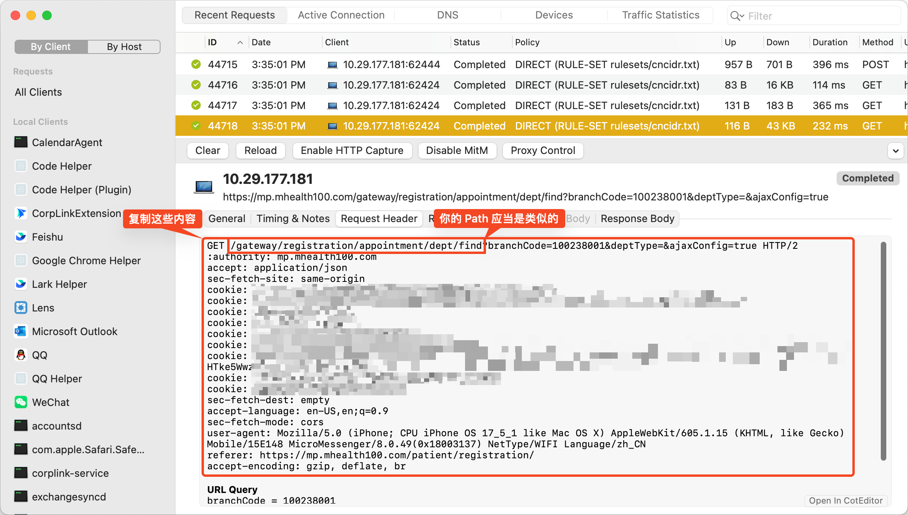
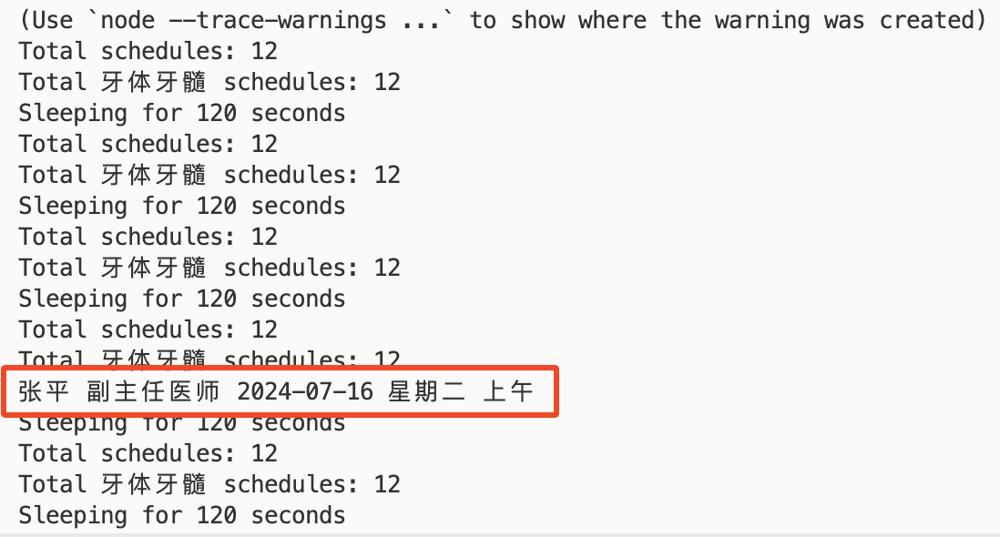
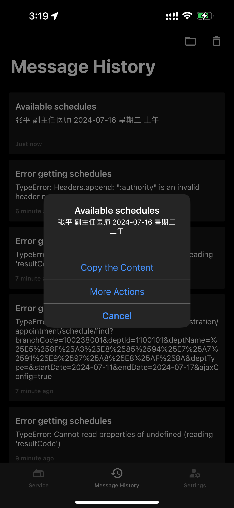

## 背景

最近牙齿有点问题，去校医院一看，妈的有点严重，感觉得做根管了，需要转院去北医三院看。


有一说一，北医三院的口腔科 *牙体牙髓* 是真的难抢，基本就是秒没。早起了一天，一早起来前一秒还有，后面没了，抓狂。但是！作为一个安静文明的人，不能因为这种事情就抓狂，需要冷静分析，优化流程。让我们复盘一下卡在哪里。

我们可以分为两种情况 **抢号** 和 **捡漏**：

1. **抢号**。早上 7 点抢号，这时候所有号都放出来了，只要你快速点进去，支付，就能抢到。所以，这时候最重要的是快速点进去，支付。那么我们大概需要优化这些问题：
   - 网页没有过滤功能，大量非“牙体牙髓”的医生干扰了视线，需要频繁上下滑动找“牙体牙髓”，浪费了大量抢号时间。
   
   - 挂号前必须 3 秒阅读协议，**极大地** 拖累了抢号速度。
   

2. **捡漏**。平时等待捡漏的话一般都是没有余号的，这时最重要的事是尽早知道什么时候有号（毕竟平时你不会一直去刷），一旦有号，马上通过手机推送给我。

好！我们来解决这三个问题：

1. 网页过滤
2. 等待去除
3. 余号推送

有人会问，你怎么不用脚本自动抢号？这个问题我也想过，但是涉及到支付等，操作太多，需要大量测试，对我来说不值得。反正都是早起抢号，优化手动抢号流程一般来说这就够了。

> 注意，不要用北医三院 APP ，1. 这玩意非常慢 2. 返回 body 加密 3. 不能开代理，不方便我们操作。用微信小程序（实际上是网页）的成功率更高。

## 医生过滤

过滤医生的列表，让我们在手机上能快速找到我们需要的医生。

通过对网页的抓包可以看到简单的对应关系：


具体来说，请求 `https://mp.mhealth100.com/gateway/registration/appointment/schedule/find` 这个 API ，我们可以根据 body 中的 `.data[].dockorTitle` 找到是什么专业的医生（有时在 `.data[].desc` 里面）。

那我们要做的就是修改这个 API 返回的医生列表，只保留我们需要的医生。

这里我用的是 Surge ，所以直接用 Surge 的 Script 功能来实现，手机走电脑代理，信任根证书即可。


修改上方你需要的过滤条件，保存这段 JavaScript 至文件：

```javascript
// Any doctor with the title or description containing any exclude keyword will be excluded.
const excludeKeywords = [
    "自费",
]

// Any doctor with the title or description containing any include keyword will be included.
const includeKeywords = [
    "牙髓",
    "牙体"
]

function filter() {
    const url = $request.url
    // We only care about the schedule list.
    if (!url.startsWith("https://mp.mhealth100.com/gateway/registration/appointment/schedule/find")) {
        return
    }

    let body = JSON.parse($response.body)
    // Make sure the response is valid.
    if (body.resultCode != "0") {
        return
    }

    let filteredData = []
    body.data.forEach(s => {
        // Any exclude keyword found, skip.
        for (let keyword of excludeKeywords) {
            if (s.doctorTitle.includes(keyword) || s.desc.includes(keyword)) {
                return
            }
        }
        // Any include keyword found, keep.
        for (let keyword of includeKeywords) {
            if (s.doctorTitle.includes(keyword) || s.desc.includes(keyword)) {
                filteredData.push(s)
                return
            }
        }
    })

    body.data = filteredData

    // Update the response.
    $done({
        body: JSON.stringify(body)
    })
}

filter()
```

在 Surge 中添加上面的脚本，限制一下 URL Regular Expression 为 `^https://mp.mhealth100.com/gateway/registration/appointment/schedule/find.*` 限制作用范围：


在手机上测试，搞定！只剩我想看的了，再也不用上下滑半天了！


## 等待去除

去除挂号前阅读协议的强制 3s 等待时间。

因为等待的过程是大概率是前端进行的，而且写在 js 里面，防止微信浏览器缓存 js 脚本不去请求（这样我们能在抓包的时候抓到它，查看内容），进入微信设置 -> 通用 -> 存储空间 -> 缓存 -> 网页浏览插件 -> 清理。

打开网页，并抓包，通过搜索关键词找到对应代码位置，可以看到在 `https://mp.mhealth100.com/patient/registration/js/appointment-choise-doctor-xxx.js` 中有可疑代码：


发现代码是 minimized （可预见），但是好像已经看见突破口了（`disabled: e.disabled` 似乎控制着这个按钮的可点击与否）：


为了看起来更舒服，我们格式化一下这部分代码：

```javascript
([e._v("不同意")]), r("button", {
staticClass: "btn btn-agree",
attrs: {
	size: "default",
	type: "second",
	disabled: e.disabled
},
on: {
	click: e.handleAgree
}
}, [e._v("我已阅读并同意"), r("span", {
directives: [{
	name: "show",
	rawName: "v-show",
	value: e.time > 0,
	expression: "time > 0"
}]
}, [e._v("(" + e._s(e.time) + "S)")])]), 1
```

看到 `disabled: e.disabled` 就该知道怎么办了，暴力替换！直接把 `e.disabled` 改成 `false` 就行，强制启用同意按钮。有人会问，你怎么不去把 `time` 改成 0 ？不错，改 `time` 和加快倒计时的 `setInterval` 应当也行，不过既然 `disabled` 能直接改，我们不妨用最简单的方法。

在 Surge 的 Script 中实现一下，保存下面的脚本为文件：

```javascript
function fuckDelay() {
    const url = $request.url
    if (!url.startsWith("https://mp.mhealth100.com/patient/registration/js/appointment-choise-doctor")) {
        return
    }

    let body = $response.body

    // Just enable the fucking button!
    body = body?.replaceAll('e.disabled', 'false')

    $done({
        body
    })
}

fuckDelay()
```

在 Surge 中启用脚本，限制一下 URL Regular Expression 为 `^https://mp.mhealth100.com/patient/registration/js/appointment-choise-doctor.*\.js` 限制作用范围：


上手机！测试（记得跟开头一样清理一遍微信缓存，强制让微信浏览器拉我们修改过的 js ）。不用等 3 秒啦！能直接点进去了！这下领先一步了！


注意：如果发现什么时候等待又有了，记得清理缓存，可能是因为你代理关掉之后又变回未修改的js了。

## 余号推送

如果平时去看的话，正常情况所有牙体牙髓医生的号应该都是全部约满的。想在平时约到的话，只能等别人退号了你刚好捡漏。但是要等到这个机会，靠自己看刚好碰上是相当困难的的。

这时候就需要一个脚本帮我们时刻查询，是否有剩余的号。我随便手糊了一个脚本，自动查询关键词内的号，然后通过 Bark App 推送到手机上。靠这个帮我抢到了张平医生的号哈哈。

```javascript
#!/usr/bin/env node

process.env['NODE_TLS_REJECT_UNAUTHORIZED'] = 0;

// Any doctor with the title or description containing any exclude keyword will be excluded.
const excludeKeywords = [
    "自费",
]

// Any doctor with the title or description containing any include keyword will be included.
const includeKeywords = [
    "牙髓",
    "牙体"
]

// !!!!! FILL THIS AREA !!!!!
// Search for the APP called Bark on iOS App Store. Install it and paste the provided URL here.
const barkUrl = "https://api.day.app/XXXXXX"

// !!!!! FILL THIS AREA !!!!!
// Copy the headers from the request made by the browser to the server. 
// Note that you need to use the request that searches schedules, i.e., 
// the request path should look like:
// /gateway/registration/appointment/schedule/find
const header = `
GET /gateway/registration/appointment/schedule/find?branchCode=100238001&deptId=1100101&deptName=xxx&deptType=&startDate=2024-07-11&endDate=2024-07-17&ajaxConfig=true HTTP/2
:authority: mp.mhealth100.com
accept: application/json
sec-fetch-site: same-origin
cookie: xxx=1720681665
cookie: xxx=1720625377,1720661564,1720674293,1720681563
cookie: gray-active=false
cookie: providerId=wechat
cookie: token=xxx
cookie: userId=xxx
cookie: wechat_access_token=xxx
cookie: wechat_openId=xxx
cookie: HMACCOUNT=xxx
sec-fetch-dest: empty
accept-language: en-US,en;q=0.9
sec-fetch-mode: cors
user-agent: Mozilla/5.0 (iPhone; CPU iPhone OS 17_5_1 like Mac OS X) AppleWebKit/605.1.15 (KHTML, like Gecko) Mobile/15E148 MicroMessenger/8.0.49(0x18003137) NetType/WIFI Language/zh_CN
referer: https://mp.mhealth100.com/patient/registration/
accept-encoding: gzip, deflate, br
`

// parse headers into object
const headers = {}

let url = "https://mp.mhealth100.com"

header.split("\n").forEach(h => {
    if (!h) {
        return
    }
    if (h.startsWith("GET")) {
        url += h.split(" ")[1]
        return
    }
    if (h.startsWith(":")) {
        return
    }
    let [key, value] = h.split(": ", 2)
    if (!key || !value) {
        return
    }
    key = key.trim()
    value = value.trim()

    if (headers[key]) {
        headers[key] += "; " + value
        return
    }

    headers[key] = value
})

console.log(url)
console.log(headers)

function sendMessage(title, msg) {
    if (barkUrl) {
        fetch(`${barkUrl}/${encodeURIComponent(title)}/${encodeURIComponent(msg)}`).then(res => res.text()).catch(error => console.error('Error:', error));
    }
}

let firstRun = true

async function main() {
    for (; ;) {
        if (firstRun) {
            firstRun = false
        } else {
            console.log("Sleeping for 120 seconds")
            await new Promise(r => setTimeout(r, 120_000))
        }
        try {
            const res = await fetch(url, {
                method: "GET",
                headers,
            }).then(res => res.json()).catch(error => {
                console.error('Error:', error)
                sendMessage("Error getting schedules", `${error}`)
            });

            if (res.resultCode != "0") {
                throw new Error(`Error getting schedules: ${res.resultDesc}`)
            }

            const schedules = res.data

            console.log(`Total schedules: ${schedules.length}`)

            let filteredSchedules = []

            schedules.forEach(s => {
                // Any exclude keyword found, skip.
                for (let keyword of excludeKeywords) {
                    if (s.doctorTitle.includes(keyword) || s.desc.includes(keyword)) {
                        return
                    }
                }
                // Any include keyword found, keep.
                for (let keyword of includeKeywords) {
                    if (s.doctorTitle.includes(keyword) || s.desc.includes(keyword)) {
                        filteredSchedules.push(s)
                        return
                    }
                }
            })

            console.log(`Total filtered schedules: ${filteredSchedules.length}`)

            let availableSchedules = []

            let msg = ""

            filteredSchedules.forEach(s => {
                const schedules = s.scheduleInfos
                schedules.forEach(schedule => {
                    if (+schedule.regLeaveCount > 0) {
                        availableSchedules.push(s)
                        console.log(s.doctorName, s.doctorTitle, schedule.regDate, schedule.weekName, schedule.shiftName)
                        msg += `${s.doctorName} ${s.doctorTitle} ${schedule.regDate} ${schedule.weekName} ${schedule.shiftName}\n`
                    }
                })
            })

            if (availableSchedules.length > 0 && msg.length > 0) {
                sendMessage("Available schedules", msg)
            }
        } catch (error) {
            console.error('Error:', error)
            sendMessage("Error getting schedules", `${error}`)
            break
        }
    }
}

main()
```

你只需用 node 运行这个脚本即可。注意：

1. 一定要填写文章标注的地方，`barkUrl` 很好说，安装 Bark 之后就会有。 `header` 的话找你查找医生时候的请求（看脚本中的注释），复制出来里面的 header （全部复制！包括 HTTP method 和 URL ），然后复制到代码里标注的地方即可。
2. 由于 token 更新频繁，如果 token 过期了会通过手机更新提醒你出错了，这时你需要手机上再打开小程序（网页），电脑上抓包找到新的 header 并替换。第一行 GET xxx 记得不要漏了，因为里面有日期，每天不一样，日期不对会出错。



运行！一旦有号，你的手机就会收到通知了！比如这是我捡漏的时候的通知：





我也成功通过这个方式抢到了张平医生的号。当时在专心写代码，手机突然震了一下，一看有号了，马上以迅雷不及掩耳之势，点开小程序，支付，成功！

## 结论

好！今日的折腾就到这里， 7 点抢号见！

Tips：
1. 提前找个号挂，填过挂号信息，不然到时候填信息太慢了；
2. 一旦快到 7 点了，因为都在刷，小程序会很卡，这时你不要刷新网页或者退出去，这样会全部重载资源很慢；
3. 在选医生的时候，不要点第一个“全部日期”这样会查所有的日期，查询量大，慢；你要在前一天和当天的日期这两个疯狂互相点，如果限流了，继续点；如果在转圈加载了，别点了，等载出来。

> 关于怎么用 Surge 做这种 HTTPS web debugging 我后续可能会单独出一篇文章（有精力的话）。
