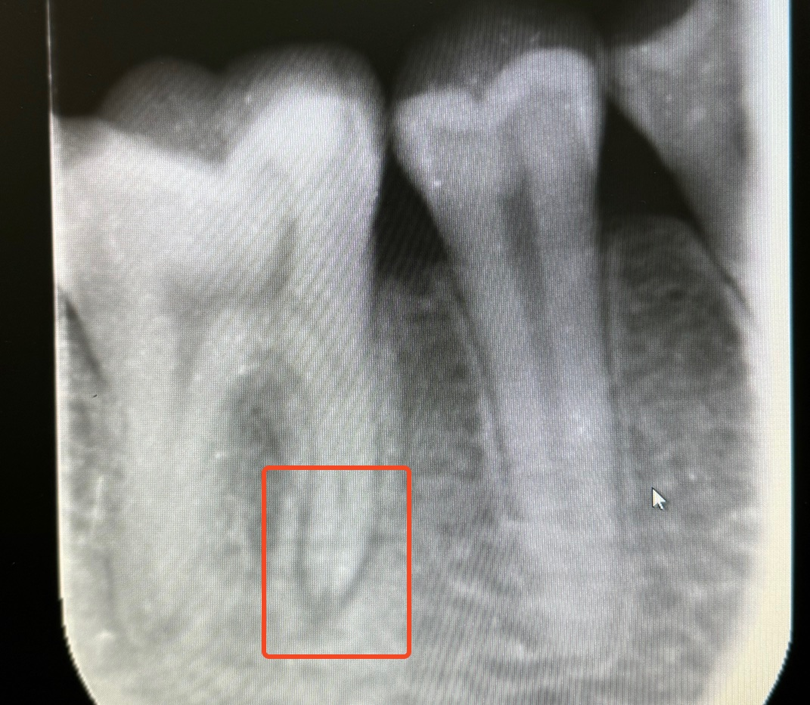
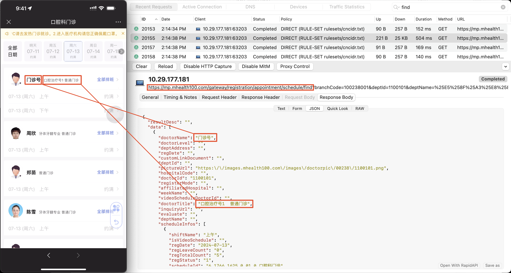
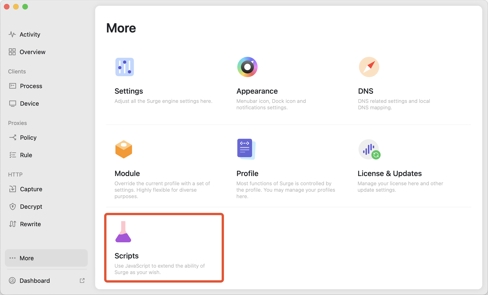
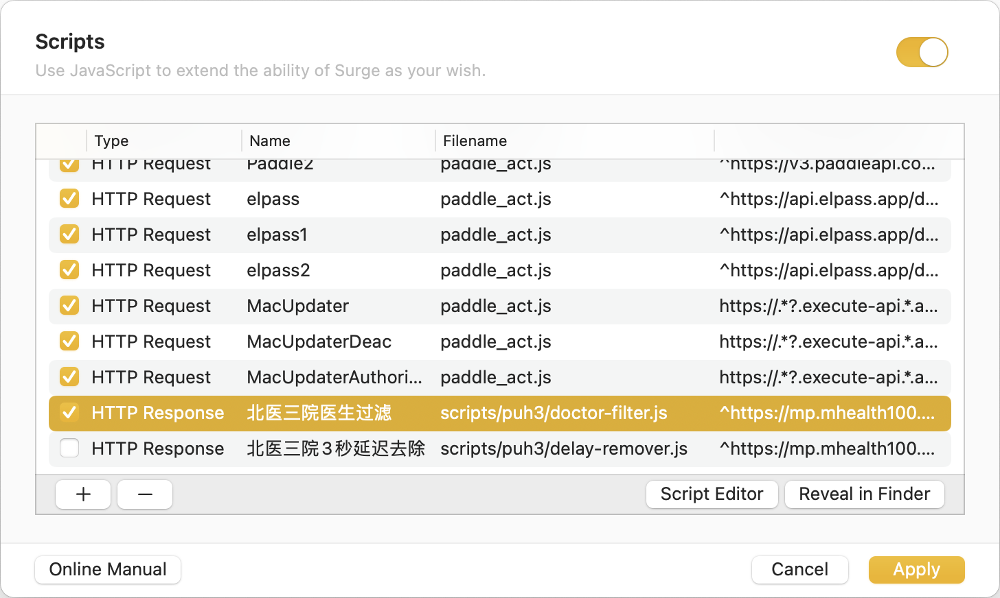
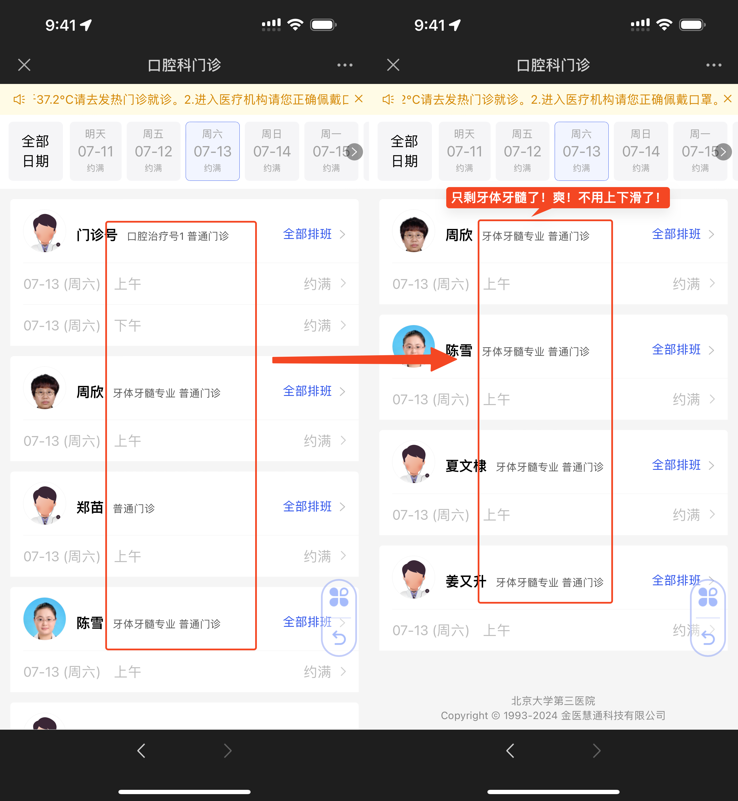
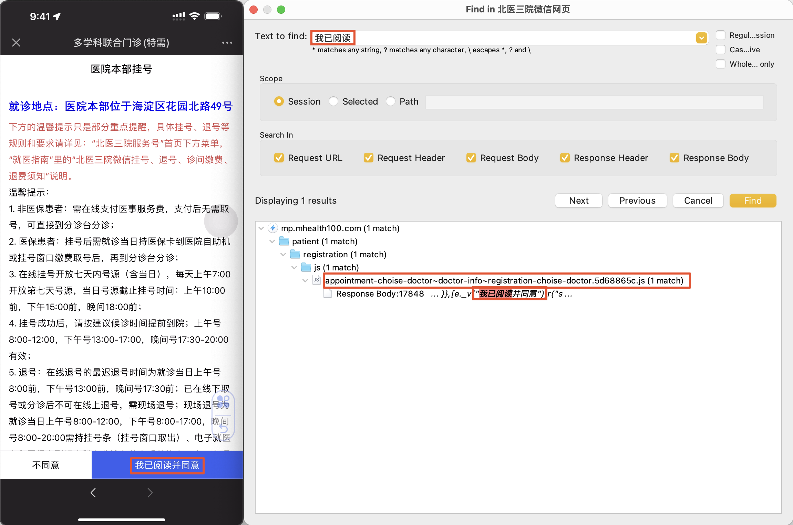
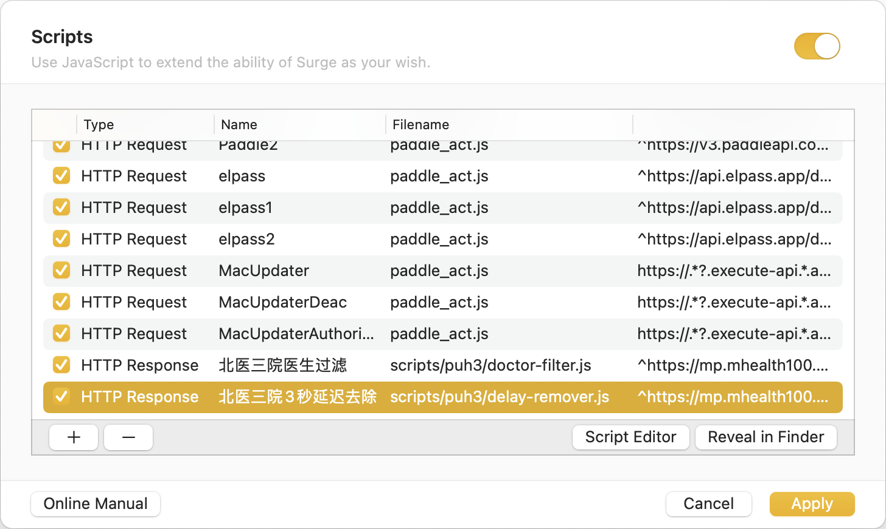

## 背景

最近牙齿有点问题，去校医院一看，妈的有点严重，感觉得做根管了，需要转院去北医三院看。



有一说一，北医三院的口腔科 *牙体牙髓* 是真的难抢，基本就是秒没。早起了一天，一早起来前一秒还有，后面没了，抓狂。但是！作为一个安静文明的人，不能因为这种事情就抓狂，需要冷静分析，优化流程。让我们复盘一下卡在哪里：

1. 网页没有过滤功能，大量非“牙体牙髓”的医生干扰了视线，需要频繁上下滑动找“牙体牙髓”，浪费了大量抢号时间。
   
2. 挂号前必须 3 秒阅读协议，**极大地** 拖累了抢号速度。
   

好！我们来解决这两个问题。

有人会问，你怎么不用脚本自动抢号？这个问题我也想过，但是涉及到支付等，操作太多，需要大量测试，对我来说不值得。反正都是早起抢号，优化手动抢号流程一般来说这就够了。

> 注意，不要用北医三院 APP ，1. 这玩意非常慢 2. 返回 body 加密 3. 不能开代理，不方便我们操作。用微信小程序（实际上是网页）的成功率更高。

## 医生过滤

通过对网页的抓包可以看到简单的对应关系：



具体来说，请求 `https://mp.mhealth100.com/gateway/registration/appointment/schedule/find` 这个 API ，我们可以根据 body 中的 `.data[].dockorTitle` 找到是什么专业的医生（有时在 `.data[].desc` 里面）。

那我们要做的就是修改这个 API 返回的医生列表，只保留我们需要的医生。

这里我用的是 Surge ，所以直接用 Surge 的 Script 功能来实现，手机走电脑代理，信任根证书即可。



```javascript
// Any doctor with the title or description containing any exclude keyword will be excluded.
const excludeKeywords = [
    "自费",
]

// Any doctor with the title or description containing any include keyword will be included.
const includeKeywords = [
    "牙髓",
    "牙体"
]

function filter() {
    const url = $request.url
    // We only care about the schedule list.
    if (!url.startsWith("https://mp.mhealth100.com/gateway/registration/appointment/schedule/find")) {
        return
    }

    let body = JSON.parse($response.body)
    // Make sure the response is valid.
    if (body.resultCode != "0") {
        return
    }

    let filteredData = []
    body.data.forEach(s => {
        // Any exclude keyword found, skip.
        for (let keyword of excludeKeywords) {
            if (s.doctorTitle.includes(keyword) || s.desc.includes(keyword)) {
                return
            }
        }
        // Any include keyword found, keep.
        for (let keyword of includeKeywords) {
            if (s.doctorTitle.includes(keyword) || s.desc.includes(keyword)) {
                filteredData.push(s)
                return
            }
        }
    })

    body.data = filteredData

    // Update the response.
    $done({
        body: JSON.stringify(body)
    })
}

filter()
```

在 Surge 中添加脚本：



在手机上测试，搞定！只剩我想看的了，再也不用上下滑半天了！



## 3 秒等待去除

因为等待的过程是大概率是前端进行的，而且写在 js 里面，防止微信浏览器缓存 js 脚本（为了我们能在抓包的时候抓到它），进入微信设置 -> 通用 -> 存储空间 -> 缓存 -> 网页浏览插件 -> 清理。

打开网页，并抓包，通过搜索关键词找到对应代码位置：



发现代码是 minimized （可预见），但是好像已经看见突破口了（`disabled`）：


没事，我们格式化一下这部分代码：

```javascript
([e._v("不同意")]), r("button", {
staticClass: "btn btn-agree",
attrs: {
	size: "default",
	type: "second",
	disabled: e.disabled
},
on: {
	click: e.handleAgree
}
}, [e._v("我已阅读并同意"), r("span", {
directives: [{
	name: "show",
	rawName: "v-show",
	value: e.time > 0,
	expression: "time > 0"
}]
}, [e._v("(" + e._s(e.time) + "S)")])]), 1
```

看到 `disabled: e.disabled` 就该知道怎么办了，暴力替换！直接把 `e.disabled` 改成 `false` 就行，强制启用同意按钮。有人会问，你怎么不去把 `time` 改成 0 ？不错，我确实试过改 `time` 和倒计时的 `setInterval`，不太好改。既然 `disabled` 能直接改，我们不妨用最简单的方法。

在 Surge 的 Script 中实现一下：

```javascript
function fuckDelay() {
    const url = $request.url
    if (!url.startsWith("https://mp.mhealth100.com/patient/registration/js/appointment-choise-doctor")) {
        return
    }

    let body = $response.body

    // Just enable the fucking button!
    body = body?.replaceAll('e.disabled', 'false')

    $done({
        body
    })
}

fuckDelay()
```

在 Surge 中启用脚本：



上手机！测试（记得跟开头一样清理一遍微信缓存，强制让微信浏览器拉我们修改过的 js ）。不用等 3 秒啦！能直接点进去了！这下领先一步了！


## 结论

好！今日的折腾就到这里，明天早上 7 点抢号见！

> 关于怎么用 Surge 做这种 HTTPS web debugging 我后续可能会单独出一篇文章（有精力的话）。
> 