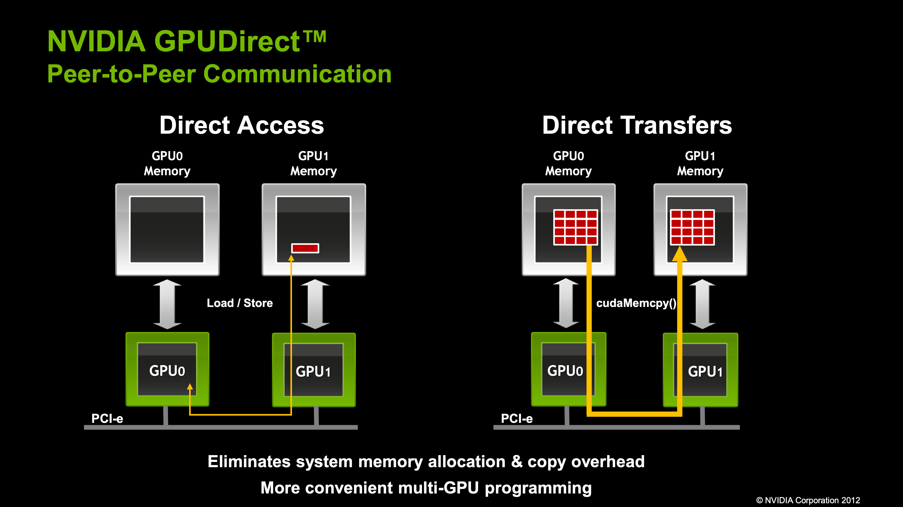

If you want see the test results directly, please jump to the [Test the unlocked performance](#test-the-unlocked-performance) section.

## What is P2P?

From NVIDIA: GPUDirect Peer to Peer enables GPU-to-GPU copies as well as loads and stores directly over the memory fabric (PCIe, NVLink). GPUDirect Peer to Peer is supported natively by the CUDA Driver.



As you can see, GPUDirect P2P allows for direct memory access between GPUs, bypassing the CPU and system memory. This can lead to significant performance improvements in multi-GPU systems. For example, in a multi-GPU LLM inference system, the data can be directly transferred between GPUs without involving the CPU, reducing latency and improving throughput.

## Why is P2P disabled on RTX4090?

Easy, NVIDIA wants to make money. They want you to buy the more expensive Tesla GPUs if you want P2P.

## Test machine configuration

- CPU: 2 x AMD EPYC 7542 (32C 64T, 225W TDP, 2.9GHz base, 3.4GHz boost)
- MEM: 2 x 8 x 32GB 3200MT/s DDR4 ECC
- GPU: 8 x NVIDIA GeForce RTX 4090 (24GB GDDR6X, 450W TDP)

Topology (ideally, the GPUs should be behind a PCIe switch, but our test machine doesn't have one):

```
        GPU0    GPU1    GPU2    GPU3    GPU4    GPU5    GPU6    GPU7    NIC0    NIC1    NIC2    NIC3    CPU Affinity    NUMA Affinity   GPU NUMA ID
GPU0     X      SYS     SYS     SYS     SYS     SYS     SYS     SYS     SYS     SYS     SYS     SYS     24-31,88-95     3               N/A
GPU1    SYS      X      SYS     SYS     SYS     SYS     SYS     SYS     SYS     SYS     SYS     SYS     16-23,80-87     2               N/A
GPU2    SYS     SYS      X      SYS     SYS     SYS     SYS     SYS     SYS     SYS     SYS     SYS     8-15,72-79      1               N/A
GPU3    SYS     SYS     SYS      X      SYS     SYS     SYS     SYS     SYS     SYS     SYS     SYS     0-7,64-71       0               N/A
GPU4    SYS     SYS     SYS     SYS      X      SYS     SYS     SYS     SYS     SYS     SYS     SYS     56-63,120-127   7               N/A
GPU5    SYS     SYS     SYS     SYS     SYS      X      SYS     SYS     SYS     SYS     SYS     SYS     48-55,112-119   6               N/A
GPU6    SYS     SYS     SYS     SYS     SYS     SYS      X      SYS     PHB     PHB     PHB     PHB     40-47,104-111   5               N/A
GPU7    SYS     SYS     SYS     SYS     SYS     SYS     SYS      X      SYS     SYS     SYS     SYS     32-39,96-103    4               N/A
NIC0    SYS     SYS     SYS     SYS     SYS     SYS     PHB     SYS      X      PIX     PHB     PHB
NIC1    SYS     SYS     SYS     SYS     SYS     SYS     PHB     SYS     PIX      X      PHB     PHB
NIC2    SYS     SYS     SYS     SYS     SYS     SYS     PHB     SYS     PHB     PHB      X      PIX
NIC3    SYS     SYS     SYS     SYS     SYS     SYS     PHB     SYS     PHB     PHB     PIX      X 

Legend:

  X    = Self
  SYS  = Connection traversing PCIe as well as the SMP interconnect between NUMA nodes (e.g., QPI/UPI)
  NODE = Connection traversing PCIe as well as the interconnect between PCIe Host Bridges within a NUMA node
  PHB  = Connection traversing PCIe as well as a PCIe Host Bridge (typically the CPU)
  PXB  = Connection traversing multiple PCIe bridges (without traversing the PCIe Host Bridge)
  PIX  = Connection traversing at most a single PCIe bridge
  NV#  = Connection traversing a bonded set of # NVLinks

NIC Legend:

  NIC0: mlx5_0
  NIC1: mlx5_1
  NIC2: mlx5_2
  NIC3: mlx5_3
```

## Test the original performance

### PCI BAR

Only 256MB of BAR memory is available. Note that I did enabled Resizable BAR in the BIOS (not my fault).

```console
# nvidia-smi -q | grep -i bar -A 3
    BAR1 Memory Usage
        Total                             : 256 MiB
        Used                              : 1 MiB
        Free                              : 255 MiB
```

### NCCL Tests

Building NCCL Tests

```bash
git clone --depth=1 https://github.com/NVIDIA/nccl-tests.git
cd nccl-tests
make -j$(nproc)
```

Runnning:

- Around 14.5GB/s of bandwidth.

```console
# ./build/all_reduce_perf -b 8 -e 128M -f 2 -g 8
# nThread 1 nGpus 8 minBytes 8 maxBytes 134217728 step: 2(factor) warmup iters: 5 iters: 20 agg iters: 1 validation: 1 graph: 0
#
# Using devices
#  Rank  0 Group  0 Pid 1756513 on <REDACTED> device  0 [0x01] NVIDIA GeForce RTX 4090
#  Rank  1 Group  0 Pid 1756513 on <REDACTED> device  1 [0x25] NVIDIA GeForce RTX 4090
#  Rank  2 Group  0 Pid 1756513 on <REDACTED> device  2 [0x41] NVIDIA GeForce RTX 4090
#  Rank  3 Group  0 Pid 1756513 on <REDACTED> device  3 [0x61] NVIDIA GeForce RTX 4090
#  Rank  4 Group  0 Pid 1756513 on <REDACTED> device  4 [0x81] NVIDIA GeForce RTX 4090
#  Rank  5 Group  0 Pid 1756513 on <REDACTED> device  5 [0xa1] NVIDIA GeForce RTX 4090
#  Rank  6 Group  0 Pid 1756513 on <REDACTED> device  6 [0xc1] NVIDIA GeForce RTX 4090
#  Rank  7 Group  0 Pid 1756513 on <REDACTED> device  7 [0xe1] NVIDIA GeForce RTX 4090
#
#                                                              out-of-place                       in-place          
#       size         count      type   redop    root     time   algbw   busbw #wrong     time   algbw   busbw #wrong
#        (B)    (elements)                               (us)  (GB/s)  (GB/s)            (us)  (GB/s)  (GB/s)       
           8             2     float     sum      -1    38.83    0.00    0.00      0    40.43    0.00    0.00      0
          16             4     float     sum      -1    38.73    0.00    0.00      0    38.59    0.00    0.00      0
          32             8     float     sum      -1    41.85    0.00    0.00      0    42.55    0.00    0.00      0
          64            16     float     sum      -1    42.55    0.00    0.00      0    42.65    0.00    0.00      0
         128            32     float     sum      -1    42.42    0.00    0.01      0    42.88    0.00    0.01      0
         256            64     float     sum      -1    42.44    0.01    0.01      0    42.53    0.01    0.01      0
         512           128     float     sum      -1    42.58    0.01    0.02      0    42.68    0.01    0.02      0
        1024           256     float     sum      -1    44.04    0.02    0.04      0    42.39    0.02    0.04      0
        2048           512     float     sum      -1    42.91    0.05    0.08      0    42.61    0.05    0.08      0
        4096          1024     float     sum      -1    43.18    0.09    0.17      0    42.69    0.10    0.17      0
        8192          2048     float     sum      -1    44.02    0.19    0.33      0    42.96    0.19    0.33      0
       16384          4096     float     sum      -1    43.10    0.38    0.67      0    42.99    0.38    0.67      0
       32768          8192     float     sum      -1    44.18    0.74    1.30      0    43.63    0.75    1.31      0
       65536         16384     float     sum      -1    45.66    1.44    2.51      0    45.28    1.45    2.53      0
      131072         32768     float     sum      -1    67.27    1.95    3.41      0    54.86    2.39    4.18      0
      262144         65536     float     sum      -1    124.8    2.10    3.68      0    121.1    2.17    3.79      0
      524288        131072     float     sum      -1    196.9    2.66    4.66      0    200.5    2.61    4.58      0
     1048576        262144     float     sum      -1    222.8    4.71    8.24      0    226.1    4.64    8.12      0
     2097152        524288     float     sum      -1    373.4    5.62    9.83      0    358.6    5.85   10.23      0
     4194304       1048576     float     sum      -1    580.8    7.22   12.64      0    592.0    7.09   12.40      0
     8388608       2097152     float     sum      -1   1041.8    8.05   14.09      0   1040.2    8.06   14.11      0
    16777216       4194304     float     sum      -1   1972.8    8.50   14.88      0   1979.5    8.48   14.83      0
    33554432       8388608     float     sum      -1   3905.6    8.59   15.04      0   3919.0    8.56   14.98      0
    67108864      16777216     float     sum      -1   7907.1    8.49   14.85      0   7905.3    8.49   14.86      0
   134217728      33554432     float     sum      -1    16253    8.26   14.45      0    16227    8.27   14.47      0
# Out of bounds values : 0 OK
# Avg bus bandwidth    : 4.85265 
#
```

### P2P Bandwidth and Latency

Building:

```bash
git clone --depth=1 https://github.com/NVIDIA/cuda-samples.git
cd cuda-samples/Samples/5_Domain_Specific/p2pBandwidthLatencyTest
make -j$(nproc)
```

Running:

- About 21GB/s bidirectional bandwidth
- 10us+ GPU-GPU latency

```console
# ./p2pBandwidthLatencyTest
P2P Connectivity Matrix
     D\D     0     1     2     3     4     5     6     7
     0       1     0     0     0     0     0     0     0
     1       0     1     0     0     0     0     0     0
     2       0     0     1     0     0     0     0     0
     3       0     0     0     1     0     0     0     0
     4       0     0     0     0     1     0     0     0
     5       0     0     0     0     0     1     0     0
     6       0     0     0     0     0     0     1     0
     7       0     0     0     0     0     0     0     1
Unidirectional P2P=Disabled Bandwidth Matrix (GB/s)
   D\D     0      1      2      3      4      5      6      7 
     0 909.49  18.77  19.56  20.23  18.72  19.29  19.34  19.83 
     1  19.95 919.12  18.93  20.18  18.83  19.23  19.24  19.80 
     2  19.87  19.55 919.66  20.27  18.82  19.28  19.29  19.77 
     3  19.92  19.48  19.56 918.58  18.82  19.23  19.19  19.80 
     4  19.88  20.58  19.74  20.54 920.15  18.38  18.89  18.71 
     5  20.04  20.19  19.80  20.37  18.75 921.29  18.88  19.08 
     6  20.04  20.11  19.71  20.60  18.77  18.58 920.74  18.62 
     7  20.02  20.21  19.73  20.33  18.37  18.74  18.89 921.29 
Unidirectional P2P=Enabled Bandwidth (P2P Writes) Matrix (GB/s)
   D\D     0      1      2      3      4      5      6      7 
     0 910.02  18.83  19.55  20.27  18.76  19.36  19.26  19.83 
     1  19.95 920.20  18.92  20.19  18.83  19.26  19.21  19.80 
     2  19.82  19.61 919.66  20.28  18.86  19.29  19.34  19.75 
     3  19.91  19.47  19.60 920.20  18.83  19.26  19.16  19.81 
     4  19.78  20.43  19.75  20.56 920.25  18.60  18.85  18.75 
     5  20.02  20.24  19.76  20.45  18.80 922.37  18.89  19.15 
     6  20.06  20.12  19.75  20.59  18.80  18.58 921.25  18.61 
     7  20.02  20.16  19.80  20.38  18.41  18.72  18.87 920.83 
Bidirectional P2P=Disabled Bandwidth Matrix (GB/s)
   D\D     0      1      2      3      4      5      6      7 
     0 916.15  21.03  21.53  21.54  20.69  21.02  21.10  21.06 
     1  21.39 920.74  21.59  21.52  20.55  21.02  20.50  21.18 
     2  21.15  21.48 921.83  21.20  20.58  21.11  20.98  21.09 
     3  21.38  21.67  21.42 922.65  20.53  21.05  20.65  21.21 
     4  20.86  20.89  20.86  20.95 923.69  19.99  20.11  19.97 
     5  20.90  20.97  21.00  21.02  20.22 922.10  20.15  20.30 
     6  20.94  20.62  20.89  20.61  19.98  20.07 923.11  19.99 
     7  21.07  21.13  21.10  21.22  20.00  20.29  20.11 923.46 
Bidirectional P2P=Enabled Bandwidth Matrix (GB/s)
   D\D     0      1      2      3      4      5      6      7 
     0 917.23  20.86  21.49  21.56  20.63  20.99  21.05  21.13 
     1  21.30 922.37  21.61  21.56  20.53  21.08  20.49  21.15 
     2  21.15  21.47 922.36  21.16  20.50  21.06  20.94  21.10 
     3  21.39  21.60  21.39 922.92  20.63  21.09  20.69  21.22 
     4  20.89  20.86  20.81  20.89 923.46  20.12  20.05  20.02 
     5  20.88  20.98  20.99  20.87  20.20 923.65  20.12  20.39 
     6  21.05  20.63  20.89  20.67  20.07  20.05 922.92  20.02 
     7  21.01  21.12  21.06  21.19  20.01  20.31  20.13 923.16 
P2P=Disabled Latency Matrix (us)
   GPU     0      1      2      3      4      5      6      7 
     0   1.54  20.26  11.68  11.60  12.65  15.80  12.19  11.75 
     1  11.60   1.48  11.58  11.66  16.03  12.13  12.55  14.59 
     2  20.27  11.59   1.43  20.08  13.17  17.14  16.31  11.41 
     3  11.50  11.59  11.51   1.47  13.11  16.14  14.04  11.61 
     4  12.53  14.27  12.75  12.65   1.51  12.47  12.49  12.41 
     5  11.88  11.73  11.65  11.63  12.28   1.42  14.95  15.40 
     6  12.27  12.63  12.42  12.68  12.25  12.30   1.47  11.89 
     7  11.46  16.67  11.44  11.47  12.30  13.33  13.57   1.41 

   CPU     0      1      2      3      4      5      6      7 
     0   4.04  12.23  10.01   9.91  10.88  10.78  10.60  11.29 
     1   9.79   3.15   9.85  10.06  10.77  10.56  10.50  10.48 
     2  10.04   9.63   3.24   9.94  10.86  10.65  10.70  10.63 
     3   9.75   9.61   9.85   3.26  10.92  10.82  10.77  10.67 
     4  10.50  10.26  10.61  10.56   3.57  11.55  11.48  11.26 
     5  10.52  10.07  10.40  10.48  11.42   3.52  11.32  11.24 
     6  10.24  10.20  10.44  10.47  11.42  11.29   3.54  11.35 
     7  10.26  10.09  10.50  10.41  11.47  11.31  11.36   3.53 
P2P=Enabled Latency (P2P Writes) Matrix (us)
   GPU     0      1      2      3      4      5      6      7 
     0   1.54  11.67  11.75  20.27  14.49  15.77  16.95  15.91 
     1  11.67   1.48  11.44  11.59  15.22  12.17  13.20  13.18 
     2  11.58  20.27   1.43  11.50  14.60  13.73  13.21  11.38 
     3  11.58  20.06  12.12   1.47  13.16  16.17  14.67  11.67 
     4  12.88  12.78  13.92  12.58   1.50  12.46  12.59  12.50 
     5  11.48  11.93  11.78  11.88  19.18   1.42  11.59  11.40 
     6  11.95  11.70  14.90  14.00  12.42  11.41   1.46  11.63 
     7  12.96  11.45  11.60  11.53  20.55  11.32  12.94   1.40 

   CPU     0      1      2      3      4      5      6      7 
     0   3.21   9.61   9.86   9.79  10.69  10.48  10.55  10.44 
     1   9.67   3.12   9.81   9.81  10.64  10.46  10.66  10.43 
     2   9.89   9.62   3.20   9.98  10.96  10.67  10.75  10.72 
     3   9.80   9.65   9.89   3.20  10.86  10.78  10.78  10.61 
     4  10.41  10.24  10.60  10.50   3.52  11.34  11.49  11.28 
     5  10.27  10.14  11.93  14.06  14.53   4.55  16.99  19.67 
     6  20.68  20.61  20.39  20.63  20.86  14.35   5.21  14.46 
     7   9.89   9.66   9.85   9.85  10.81  10.62  10.68   3.41
```

## How to unlock P2P on RTX4090?

I encountered this legendary [modified NVIDIA driver](https://github.com/tinygrad/open-gpu-kernel-modules) by tinygrad that unlocks P2P on RTX4090 GPUs which blows my mind. Let's give it a try!

### Disable IOMMU

If the following command returns an empty list, it means that the IOMMU is disabled, otherwise, you need to disable it. Consult your motherboard manual on how to disable IOMMU.

```bash
ll /sys/class/iommu/
```

### Enable Resizable BAR

Enable Resizable BAR in the BIOS. It's required for the modified NVIDIA driver to work. Consult your motherboard manual on how to enable Resizable BAR.

### Uninstall the official NVIDIA driver

We will install our own modified NVIDIA driver, so we need to uninstall the official NVIDIA driver first.

```bash
nvidia-uninstall
reboot
```

### Install the official NVIDIA driver without kernel modules

Visit the [modified NVIDIA driver](https://github.com/tinygrad/open-gpu-kernel-modules) by tinygrad. Check out the branches with p2p in the name. There are multiple versions. You should choose one that fits. For example, I am using the [550.90.07-p2p](https://github.com/tinygrad/open-gpu-kernel-modules/tree/550.90.07-p2p) branch. Remember the version number `550.90.07`, you will need it later.

Download the official driver with the same version number as you chose (`550.90.07` in my case) from the [NVIDIA website](https://www.nvidia.com/Download/index.aspx). The driver I downloaded is `NVIDIA-Linux-x86_64-550.90.07.run`.

Install the official driver without the kernel modules because we will install our own modified kernel modules later.

```console
./NVIDIA-Linux-x86_64-550.90.07.run --no-kernel-modules
```

### Install the modified kernel modules

Clone the modified NVIDIA driver by tinygrad and install. Remember to replace the branch name with the one you chose.

```bash
git clone --depth=1 -b 550.90.07-p2p https://github.com/tinygrad/open-gpu-kernel-modules.git
cd open-gpu-kernel-modules
# Just in case
rmmod nvidia_drm nvidia_modeset nvidia_uvm nvidia
# Build and install the modified kernel modules
make modules -j$(nproc)
make modules_install
depmod
nvidia-smi -pm 1
```

## Test the unlocked performance

### PCI BAR

Now the **BAR memory is fully available**.

- 256MB -> 32GB.

```console
# nvidia-smi -q | grep -i bar -A 3
    BAR1 Memory Usage
        Total                             : 32768 MiB
        Used                              : 24211 MiB
        Free                              : 8557 MiB
```

### NCCL Tests

- 14.47GB/s -> 20.64GB/s: **42% improvement**

```
# nThread 1 nGpus 8 minBytes 8 maxBytes 134217728 step: 2(factor) warmup iters: 5 iters: 20 agg iters: 1 validation: 1 graph: 0
#
# Using devices
#  Rank  0 Group  0 Pid  33895 on <REDACTED> device  0 [0x01] NVIDIA GeForce RTX 4090
#  Rank  1 Group  0 Pid  33895 on <REDACTED> device  1 [0x25] NVIDIA GeForce RTX 4090
#  Rank  2 Group  0 Pid  33895 on <REDACTED> device  2 [0x41] NVIDIA GeForce RTX 4090
#  Rank  3 Group  0 Pid  33895 on <REDACTED> device  3 [0x61] NVIDIA GeForce RTX 4090
#  Rank  4 Group  0 Pid  33895 on <REDACTED> device  4 [0x81] NVIDIA GeForce RTX 4090
#  Rank  5 Group  0 Pid  33895 on <REDACTED> device  5 [0xa1] NVIDIA GeForce RTX 4090
#  Rank  6 Group  0 Pid  33895 on <REDACTED> device  6 [0xc1] NVIDIA GeForce RTX 4090
#  Rank  7 Group  0 Pid  33895 on <REDACTED> device  7 [0xe1] NVIDIA GeForce RTX 4090
#
#                                                              out-of-place                       in-place          
#       size         count      type   redop    root     time   algbw   busbw #wrong     time   algbw   busbw #wrong
#        (B)    (elements)                               (us)  (GB/s)  (GB/s)            (us)  (GB/s)  (GB/s)       
           8             2     float     sum      -1    38.82    0.00    0.00      0    38.16    0.00    0.00      0
          16             4     float     sum      -1    38.31    0.00    0.00      0    38.12    0.00    0.00      0
          32             8     float     sum      -1    38.57    0.00    0.00      0    40.87    0.00    0.00      0
          64            16     float     sum      -1    40.71    0.00    0.00      0    40.65    0.00    0.00      0
         128            32     float     sum      -1    40.51    0.00    0.01      0    41.66    0.00    0.01      0
         256            64     float     sum      -1    41.63    0.01    0.01      0    41.38    0.01    0.01      0
         512           128     float     sum      -1    41.67    0.01    0.02      0    42.45    0.01    0.02      0
        1024           256     float     sum      -1    41.70    0.02    0.04      0    41.67    0.02    0.04      0
        2048           512     float     sum      -1    41.74    0.05    0.09      0    41.74    0.05    0.09      0
        4096          1024     float     sum      -1    42.35    0.10    0.17      0    42.39    0.10    0.17      0
        8192          2048     float     sum      -1    42.14    0.19    0.34      0    41.88    0.20    0.34      0
       16384          4096     float     sum      -1    43.19    0.38    0.66      0    42.73    0.38    0.67      0
       32768          8192     float     sum      -1    42.17    0.78    1.36      0    42.61    0.77    1.35      0
       65536         16384     float     sum      -1    47.58    1.38    2.41      0    46.95    1.40    2.44      0
      131072         32768     float     sum      -1    72.03    1.82    3.18      0    71.50    1.83    3.21      0
      262144         65536     float     sum      -1    119.7    2.19    3.83      0    118.6    2.21    3.87      0
      524288        131072     float     sum      -1    166.6    3.15    5.51      0    159.8    3.28    5.74      0
     1048576        262144     float     sum      -1    216.1    4.85    8.49      0    217.2    4.83    8.45      0
     2097152        524288     float     sum      -1    321.5    6.52   11.42      0    322.6    6.50   11.37      0
     4194304       1048576     float     sum      -1    478.7    8.76   15.33      0    480.1    8.74   15.29      0
     8388608       2097152     float     sum      -1    798.6   10.50   18.38      0    818.0   10.26   17.95      0
    16777216       4194304     float     sum      -1   1472.8   11.39   19.94      0   1472.1   11.40   19.94      0
    33554432       8388608     float     sum      -1   2870.3   11.69   20.46      0   2866.4   11.71   20.49      0
    67108864      16777216     float     sum      -1   5705.0   11.76   20.59      0   5695.6   11.78   20.62      0
   134217728      33554432     float     sum      -1    11382   11.79   20.64      0    11380   11.79   20.64      0
# Out of bounds values : 0 OK
# Avg bus bandwidth    : 6.11168 
#
```

### P2P Bandwidth and Latency

- **P2P is now available**: see the 1s in the P2P Connectivity Matrix
- Bandwidth: 21.39GB/s -> 50.15GB/s: **134% improvement**
- Latency: 11.67us -> 1.19us: **89% reduction**

```
P2P Connectivity Matrix
     D\D     0     1     2     3     4     5     6     7
     0       1     1     1     1     1     1     1     1
     1       1     1     1     1     1     1     1     1
     2       1     1     1     1     1     1     1     1
     3       1     1     1     1     1     1     1     1
     4       1     1     1     1     1     1     1     1
     5       1     1     1     1     1     1     1     1
     6       1     1     1     1     1     1     1     1
     7       1     1     1     1     1     1     1     1
Unidirectional P2P=Disabled Bandwidth Matrix (GB/s)
   D\D     0      1      2      3      4      5      6      7 
     0 912.13  18.86  19.89  20.25  18.34  19.64  19.25  19.45 
     1  20.56 920.74  19.44  20.27  18.46  19.72  19.19  19.40 
     2  20.36  19.72 922.37  20.28  18.52  19.65  19.22  19.40 
     3  20.43  19.68  20.04 922.49  18.47  19.59  19.15  19.41 
     4  20.20  20.15  20.25  20.26 921.83  19.04  18.84  18.36 
     5  20.45  20.09  20.17  20.46  18.29 922.37  18.73  18.60 
     6  20.39  20.18  20.24  20.54  18.44  19.09 922.49  18.65 
     7  20.53  20.14  20.12  20.51  18.17  19.11  18.74 923.46 
Unidirectional P2P=Enabled Bandwidth (P2P Writes) Matrix (GB/s)
   D\D     0      1      2      3      4      5      6      7 
     0 913.74  25.60  25.85  25.85  21.36  22.41  21.74  22.48 
     1  25.78 938.91  25.79  25.79  20.70  22.39  22.53  21.63 
     2  25.70  25.95 939.00  25.78  21.42  21.59  22.21  22.16 
     3  25.60  25.93  25.53 938.42  22.14  22.30  21.70  22.45 
     4  22.41  21.61  22.35  22.49 940.70  25.69  25.96  25.90 
     5  21.34  22.38  21.72  22.41  25.77 939.57  25.95  25.87 
     6  20.57  22.27  22.32  21.60  25.75  26.01 941.73  25.83 
     7  21.32  21.52  22.39  22.48  25.51  25.83  25.75 938.44 
Bidirectional P2P=Disabled Bandwidth Matrix (GB/s)
   D\D     0      1      2      3      4      5      6      7 
     0 918.85  20.94  21.69  21.67  20.66  21.44  20.98  21.26 
     1  21.48 921.29  21.57  21.54  20.20  20.65  20.87  20.70 
     2  21.34  21.63 921.56  21.13  20.66  21.28  20.89  21.21 
     3  21.40  21.72  21.62 921.83  20.16  20.92  20.89  20.89 
     4  20.93  20.33  20.87  20.45 922.90  20.07  20.21  19.96 
     5  21.40  20.86  21.26  20.90  20.23 923.69  20.18  20.33 
     6  20.93  20.87  20.89  20.90  20.27  20.25 923.67  20.19 
     7  21.19  20.66  21.03  20.87  20.02  20.28  20.41 923.41 
Bidirectional P2P=Enabled Bandwidth Matrix (GB/s)
   D\D     0      1      2      3      4      5      6      7 
     0 916.45  50.10  50.46  50.29  39.90  41.85  40.83  41.68 
     1  50.15 919.60  50.19  50.22  38.93  41.79  41.87  40.82 
     2  49.91  50.42 920.74  50.53  40.19  40.94  41.86  41.61 
     3  50.08  50.48  50.35 919.66  40.22  41.69  40.92  41.78 
     4  41.60  40.94  41.86  41.93 919.93  49.80  50.36  50.22 
     5  40.25  41.68  39.96  41.64  49.75 921.83  50.20  50.66 
     6  39.59  41.58  41.83  40.95  49.89  50.43 921.56  50.59 
     7  40.36  40.86  41.76  41.82  49.96  50.43  50.28 921.01 
P2P=Disabled Latency Matrix (us)
   GPU     0      1      2      3      4      5      6      7 
     0   1.50  11.60  20.17  20.18  13.08  11.27  14.58  19.33 
     1  11.68   1.38  11.74  20.17  12.60  11.39  14.35  14.59 
     2  11.33  11.34   1.31  11.50  16.96  20.53  16.53  20.53 
     3  11.51  11.51  11.51   1.37  17.86  11.37  15.80  20.54 
     4  11.47  11.79  11.44  12.57   1.38  12.24  12.93  11.73 
     5  11.48  11.79  11.64  11.64  14.40   1.44  13.46  14.35 
     6  13.59  15.05  13.35  12.52  12.06  11.67   1.40  12.34 
     7  19.32  19.95  11.39  11.44  12.87  12.23  14.05   1.38 

   CPU     0      1      2      3      4      5      6      7 
     0   3.28  10.21  10.15   9.83  10.92  10.75  10.88  10.71 
     1  10.07   3.14   9.81   9.56  10.58  10.41  10.61  10.35 
     2  10.13   9.68   3.28   9.62  10.71  10.56  10.73  10.48 
     3   9.81   9.46   9.68   3.13  10.60  10.41  10.52  10.35 
     4  10.60  10.20  10.40  10.16   3.48  11.19  11.37  11.07 
     5  10.37  10.02  10.29  10.04  11.10   3.49  11.24  11.00 
     6  10.51  10.20  10.35  10.11  11.34  11.09   3.47  11.16 
     7  10.40  10.11  10.30  10.06  11.17  11.07  11.22   3.42 
P2P=Enabled Latency (P2P Writes) Matrix (us)
   GPU     0      1      2      3      4      5      6      7 
     0   1.48   1.24   1.26   1.25   1.41   1.41   1.36   1.42 
     1   1.19   1.38   1.18   1.18   1.29   1.42   1.29   1.26 
     2   1.21   1.20   1.31   1.19   1.30   1.34   1.44   1.41 
     3   1.21   1.19   1.17   1.38   1.37   1.41   1.30   1.44 
     4   1.69   1.69   1.69   1.64   1.38   1.50   1.59   1.56 
     5   1.64   1.60   1.60   1.62   1.50   1.43   1.56   1.48 
     6   1.59   1.53   1.57   1.54   1.48   1.44   1.39   1.44 
     7   1.58   1.58   1.57   1.56   1.48   1.47   1.45   1.37 

   CPU     0      1      2      3      4      5      6      7 
     0   3.27   2.84   2.76   2.74   2.80   2.76   2.76   2.75 
     1   2.80   3.13   2.66   2.74   2.70   2.70   2.68   2.69 
     2   2.83   2.80   3.26   2.85   2.85   2.78   2.77   2.76 
     3   2.78   2.69   2.70   3.24   2.69   2.70   2.98   2.67 
     4   3.18   3.11   3.10   3.09   3.55   3.12   3.09   3.08 
     5   3.12   3.04   3.10   3.05   3.06   3.50   3.08   3.04 
     6   3.20   3.11   3.18   3.11   3.11   3.16   3.57   3.08 
     7   3.12   3.06   3.08   3.12   3.08   3.07   3.04   3.58 
```

## How it works? By tinygrad.

> I am not an expert in such low-level hacking (but it's soooo interesting and I want to learn). This part is from the [modified NVIDIA driver](https://github.com/tinygrad/open-gpu-kernel-modules) by tinygrad (Thank you tinygrad). I just put it here for reference.

Normally, P2P on NVIDIA cards uses MAILBOXP2P. This is some hardware interface designed to allow GPUs to transfer memory back in the days of small BAR. It is not present or disabled in hardware on the 4090s, and that's why P2P doesn't work. There [was a bug in early versions](https://forums.developer.nvidia.com/t/standard-nvidia-cuda-tests-fail-with-dual-rtx-4090-linux-box/233202) of the driver that reported that it did work, and it was actually sending stuff on the PCIe bus. However, because the mailbox hardware wasn't present, these copies wouldn't go to the right place. You could even crash the system by doing something like `torch.zeros(10000,10000).cuda().to("cuda:1")`

In some 3090s and all 4090s, NVIDIA added large BAR support.

```
tiny@tiny14:~$ lspci -s 01:00.0 -v
01:00.0 VGA compatible controller: NVIDIA Corporation AD102 [GeForce RTX 4090] (rev a1) (prog-if 00 [VGA controller])
        Subsystem: Micro-Star International Co., Ltd. [MSI] Device 510b
        Physical Slot: 49
        Flags: bus master, fast devsel, latency 0, IRQ 377
        Memory at b2000000 (32-bit, non-prefetchable) [size=16M]
        Memory at 28800000000 (64-bit, prefetchable) [size=32G]
        Memory at 28400000000 (64-bit, prefetchable) [size=32M]
        I/O ports at 3000 [size=128]
        Expansion ROM at b3000000 [virtual] [disabled] [size=512K]
        Capabilities: <access denied>
        Kernel driver in use: nvidia
        Kernel modules: nvidiafb, nouveau, nvidia_drm, nvidia
```

Notice how BAR1 is size 32G. In H100, they also added support for a PCIe mode that uses the BAR directly instead of the mailboxes, called BAR1P2P. So, what happens if we try to enable that on a 4090?

We do this by bypassing the HAL and calling a bunch of the GH100 methods directly. Methods like `kbusEnableStaticBar1Mapping_GH100`, which maps the entire VRAM into BAR1. This mostly just works, but we had to disable the use of that region in the `MapAperture` function for some reason. Shouldn't matter.

```
[ 3491.654009] NVRM: kbusEnableStaticBar1Mapping_GH100: Static bar1 mapped offset 0x0 size 0x5e9200000
[ 3491.793389] NVRM: kbusEnableStaticBar1Mapping_GH100: Static bar1 mapped offset 0x0 size 0x5e9200000
```

Perfect, we now have the VRAM mapped. However, it's not that easy to get P2P. When you run `./simpleP2P` from `cuda-samples`, you get this error.

```
[ 3742.840689] NVRM: kbusCreateP2PMappingForBar1P2P_GH100: added PCIe BAR1 P2P mapping between GPU2 and GPU3
[ 3742.840762] NVRM: kbusCreateP2PMappingForBar1P2P_GH100: added PCIe BAR1 P2P mapping between GPU3 and GPU2
[ 3742.841089] NVRM: nvAssertFailed: Assertion failed: (shifted >> pField->shift) == value @ field_desc.h:272
[ 3742.841106] NVRM: nvAssertFailed: Assertion failed: (shifted & pField->maskPos) == shifted @ field_desc.h:273
[ 3742.841281] NVRM: nvAssertFailed: Assertion failed: (shifted >> pField->shift) == value @ field_desc.h:272
[ 3742.841292] NVRM: nvAssertFailed: Assertion failed: (shifted & pField->maskPos) == shifted @ field_desc.h:273
[ 3742.865948] NVRM: GPU at PCI:0000:01:00: GPU-49c7a6c9-e3a8-3b48-f0ba-171520d77dd1
[ 3742.865956] NVRM: Xid (PCI:0000:01:00): 31, pid=21804, name=simpleP2P, Ch 00000013, intr 00000000. MMU Fault: ENGINE CE3 HUBCLIENT_CE1 faulted @ 0x7f97_94000000. Fault is of type FAULT_INFO_TYPE_UNSUPPORTED_KIND ACCESS_TYPE_VIRT_WRITE
```

Failing with an MMU fault. So you dive into this and find that it's using `GMMU_APERTURE_PEER` as the mapping type. That doesn't seem supported in the 4090. So let's see what types are supported, `GMMU_APERTURE_VIDEO`,`GMMU_APERTURE_SYS_NONCOH`, and `GMMU_APERTURE_SYS_COH`. We don't care about being coherent with the CPU's L2 cache, but it does have to go out the PCIe bus, so we rewrite `GMMU_APERTURE_PEER` to `GMMU_APERTURE_SYS_NONCOH`. We also no longer set the peer id that was corrupting the page table.

```
cudaMemcpyPeer / cudaMemcpy between GPU0 and GPU1: 24.21GB/s
Preparing host buffer and memcpy to GPU0...
Run kernel on GPU1, taking source data from GPU0 and writing to GPU1...
Run kernel on GPU0, taking source data from GPU1 and writing to GPU0...
Copy data back to host from GPU0 and verify results...
Verification error @ element 1: val = 0.000000, ref = 4.000000
Verification error @ element 2: val = 0.000000, ref = 8.000000
```

Progress! `./simpleP2P` appears to work, however the copy isn't happening. The address is likely wrong. It turns out they have a separate field for the peer address called `fldAddrPeer`, we change that to `fldAddrSysmem`. We also print out the addresses and note that the physical BAR address isn't being added properly, they provide a field `fabricBaseAddress` for `GMMU_APERTURE_PEER`, we reuse it and put the `BAR1` base address in there.
