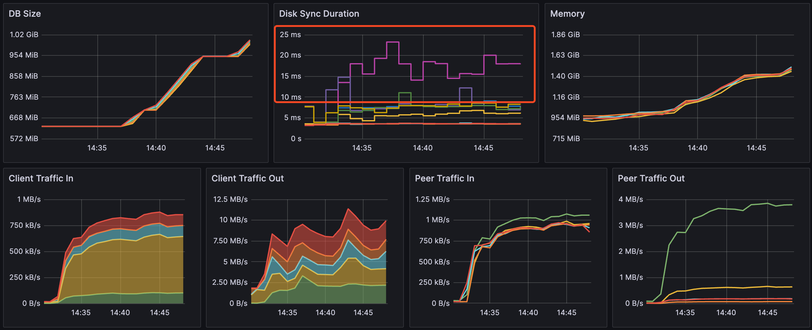
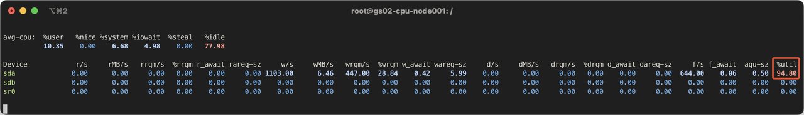

## Background

We want to test some sandbox application on our new cluster. My colleague reported that the performance is not as expected and wanted me to take a look.

The sandbox application works like this: it starts a python container, runs some scripts, and exits. They executes scripts provided by the user, so the cluster is expected to create and destroy a lot of containers in a short period of time.

## Assumptions

Considering the characteristics of the application, the bottleneck could be the following:

- CPU/Memory of the worker nodes, or the container runtime
- Performance of the master node (apiserver, etcd, and etc)

Since we have relatively beefy worker nodes, each with 2*Xeon Platinum 8353v (72C144T) and 512GB of memory, the bottleneck is likely the master node (8C 16GB memory).

Let's verify this assumption.

## Observations

I ran k6 to load test the cluster.

Pods started to pending...

Hmm, it smelled like a etcd issue (the newly-created Pods is not able to be written to the database). I looked at the etcd dashboard. Sure enough, db backend is having some trouble writing the files.

I grabed the the disk stats: the disks on the master node is almost fully utilized! A better disk (SSD) is really needed.

## Side note

We also experienced unexpected issue when I applied a cilium config, the whole cluster goes down (Thanks god. This is not a production cluster, or this will be a total disaster). At first, I assumed the cilium config that I written is wrong and I reverted, hoping the cluster will be fixed. Nope, all nodes are down. However, some interesting behavior is noticed: all worker nodes are in a ready - notready loop.

Upon further investigation, I noticed the apiserver is constantly being OOM killed.

The apiserver is using more memory than the node has.

It seems something is hitting the apiserver really hard. Under normal circumstances, I will go to the master node to look at the apiserver logs. However, the master node is down (because OOM) and I cannot ssh into it.

The cluster is stuck in such a loop:

1. Worker nodes are all starting (cilium starting) and pulling/changed config through apiserver
2. apiserver on the master node OOM'ed because of bursts of requests
3. the apiserver is OOM killed
4. worker node cannot report status to the apiserver
5. worker node is marked as not ready; cilium pods are terminated because of nodes are not ready
6. go to step 1

Since the cluster cannot properly start in such a scenario, I have to use some dirty fix to start the cluster: just after the apiserver is started, and before the apiserver eats all memory, such that the master node is still alive, quickly SSH into the master node and kill the apiserver process. By doing this a few times, we can span the burst of requests over a longer period of time, avoiding overloading the apiserver (causing it to be killed).

## Solution

The solution is simple: replace the master nodes with faster ones (much more memory, NVME SSDs).
